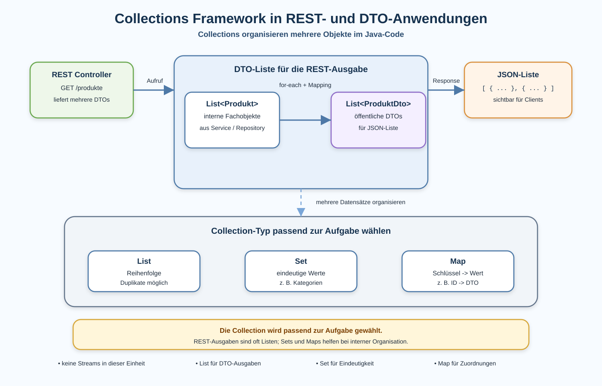

# Arbeitsblatt – Collections Framework in REST- und DTO-Anwendungen

## Lernziele

- erklären, warum REST- und DTO-Anwendungen häufig mit mehreren Objekten arbeiten
- einfache Arrays von Collections unterscheiden
- `List`, `Set` und `Map` fachlich einordnen
- `ArrayList`, `HashSet` und `HashMap` als einfache Implementierungen erkennen
- DTO-Listen für REST-Ausgaben mit einer klassischen Schleife aufbauen
- Reihenfolge und doppelte Einträge bei `List` beschreiben
- eindeutige Werte bei `Set` erklären
- das Schlüssel/Wert-Prinzip bei `Map` anwenden
- entscheiden, welche Collection für eine einfache Aufgabe passt
- typische Fehler beim Einsatz von Collections erkennen

---

## Ausgangslage

In der letzten Einheit wurden DTOs eingeführt.

Ein REST Controller gibt nun nicht mehr direkt Fachobjekte zurück, sondern DTOs:

```text
Produkt
-> Mapping
-> ProduktResponseDto
```

Bei `GET /produkte` geht es aber selten nur um ein Produkt. Meist liefert die API mehrere Produkte:

```json
[
  {
    "id": 1,
    "name": "Tastatur",
    "preis": 49.9
  },
  {
    "id": 2,
    "name": "Maus",
    "preis": 24.9
  }
]
```

Im Java-Code braucht es dafür eine Struktur für mehrere Objekte:

```java
List<ProduktResponseDto>
```

Kernidee:

```text
REST- und DTO-Anwendungen arbeiten oft mit mehreren Objekten.
Collections organisieren diese Daten im Java-Code.
```



---

## Warum Collections?

Ein einzelnes Objekt reicht, wenn genau ein Produkt gemeint ist:

```java
ProduktResponseDto produktDto;
```

Bei mehreren Produkten braucht der Code eine Sammlung:

```java
List<ProduktResponseDto> produktDtos;
```

Collections helfen bei Fragen wie:

- Welche Produkte sollen zurückgegeben werden?
- In welcher Reihenfolge sollen DTOs gesammelt werden?
- Welche Kategorien kommen nur einmal vor?
- Wie finde ich ein Produkt über seine ID?

Collections ersetzen keine Fachlogik. Sie helfen, mehrere Daten im Code zu strukturieren.

---

## Grenzen einfacher Arrays

Ein Array kann mehrere Werte speichern:

```java
ProduktResponseDto[] produktDtos = new ProduktResponseDto[3];
```

Für REST- und DTO-Anwendungen ist das oft unpraktisch:

- Die Grösse muss vorher bekannt sein.
- Hinzufügen ist umständlicher.
- Entfernen ist umständlicher.
- Der Code wird schnell technischer als nötig.

Für veränderbare Listen ist darum meist eine `ArrayList` einfacher:

```java
List<ProduktResponseDto> produktDtos = new ArrayList<>();
```

---

## List-Grundidee

Eine `List` ist eine geordnete Sammlung.

Wichtig:

- Einträge haben eine Reihenfolge.
- Doppelte Einträge sind möglich.
- Neue Einträge können hinzugefügt werden.
- Eine Liste passt gut zu REST-Ausgaben mit mehreren Objekten.

Beispiel:

```java
List<String> namen = new ArrayList<>();

namen.add("Tastatur");
namen.add("Maus");
namen.add("Maus");
```

Die Liste enthält drei Einträge. `Maus` kommt zweimal vor.

---

## ArrayList

`ArrayList` ist eine häufig verwendete Implementierung von `List`.

Für den Einstieg reicht:

```java
List<ProduktResponseDto> response = new ArrayList<>();
```

Links steht die allgemeine Sicht:

```java
List<ProduktResponseDto>
```

Rechts steht die konkrete Umsetzung:

```java
new ArrayList<>()
```

Merke:

```text
Im Code wird oft mit List gearbeitet und mit ArrayList erzeugt.
```

---

## DTO-Listen in REST-Ausgaben

Ein GET-Endpunkt kann eine Liste von DTOs zurückgeben:

```java
@GetMapping
public List<ProduktResponseDto> alleProdukte() {
    List<Produkt> produkte = lagerService.alleProdukte();
    List<ProduktResponseDto> response = new ArrayList<>();

    for (Produkt produkt : produkte) {
        response.add(toResponseDto(produkt));
    }

    return response;
}
```

Spring Boot macht daraus eine JSON-Liste.

Java:

```text
List<ProduktResponseDto>
```

JSON:

```json
[
  {
    "id": 1,
    "name": "Tastatur",
    "preis": 49.9
  }
]
```

---

## Klassische Iteration mit for-each

In dieser Einheit verwenden wir bewusst keine Streams.

Die bekannte Schleife bleibt sichtbar:

```java
for (Produkt produkt : produkte) {
    ProduktResponseDto dto = toResponseDto(produkt);
    response.add(dto);
}
```

Die Schleife bedeutet:

```text
Gehe jedes Produkt einzeln durch.
Erzeuge daraus ein DTO.
Lege das DTO in die Response-Liste.
```

Diese Idee ist wichtig. Spätere Streams machen denselben Ablauf kürzer, aber zuerst soll der Ablauf verständlich sein.

---

## Set-Grundidee

Ein `Set` ist eine Sammlung ohne doppelte Werte.

Wichtig:

- Ein Wert kommt nur einmal vor.
- Die Reihenfolge steht nicht im Zentrum.
- Ein `Set` passt, wenn Eindeutigkeit wichtig ist.

Beispiel:

```java
Set<String> kategorien = new HashSet<>();

kategorien.add("Hardware");
kategorien.add("Zubehör");
kategorien.add("Hardware");
```

Das Set enthält `Hardware` nur einmal.

REST-/DTO-Kontext:

```text
Aus mehreren Produkten sollen eindeutige Kategorien gesammelt werden.
```

---

## HashSet

`HashSet` ist eine häufig verwendete Implementierung von `Set`.

Für den Einstieg reicht:

```java
Set<String> kategorien = new HashSet<>();
```

Wichtig:

```text
Ein HashSet ist nicht für eine garantierte sichtbare Reihenfolge gedacht.
```

Wenn eine REST-Antwort eine klare Reihenfolge braucht, ist eine `List` meistens verständlicher.

---

## Map-Grundidee

Eine `Map` speichert Zuordnungen.

Jeder Eintrag hat:

- einen Schlüssel
- einen Wert

Beispiel:

```java
Map<Long, ProduktResponseDto> produkteNachId = new HashMap<>();

produkteNachId.put(1L, tastaturDto);
produkteNachId.put(2L, mausDto);
```

Zugriff:

```java
ProduktResponseDto dto = produkteNachId.get(1L);
```

Kernidee:

```text
Map bedeutet: Schlüssel -> Wert
```

---

## HashMap

`HashMap` ist eine häufig verwendete Implementierung von `Map`.

Für den Einstieg reicht:

```java
Map<Long, ProduktResponseDto> produkteNachId = new HashMap<>();
```

Typische Einsätze:

- Produkt über ID finden
- Kategorie zu Anzahl zuordnen
- Status zu Beschreibung zuordnen

Eine `Map` ist intern oft nützlich. Als REST-Ausgabe ist eine klare DTO-Liste aber häufig verständlicher.

---

## Collections in REST-Anwendungen

Collections können in verschiedenen Schichten vorkommen:

| Ort | Typischer Einsatz |
|---|---|
| Controller | DTO-Liste als REST-Antwort zurückgeben |
| Mapping | Fachobjekte in DTOs übertragen |
| Service | fachliche Listen oder Mengen verarbeiten |
| Repository | mehrere Fachobjekte laden |

Wichtig:

```text
Die Collection ersetzt keine saubere Verantwortung.
```

Der Controller soll nicht zur Sammelstelle für alle Collection-Logik werden.

---

## Typische Entscheidung

| Frage | Passende Collection |
|---|---|
| Soll eine geordnete REST-Liste zurückgegeben werden? | `List` |
| Sollen doppelte Kategorien verhindert werden? | `Set` |
| Soll ein Produkt über eine ID gefunden werden? | `Map` |

Merke:

```text
Wähle die Collection nach der Aufgabe, nicht nach Gewohnheit.
```

---

## Typische Fehler

| Fehler | Problem |
|---|---|
| falschen Collection-Typ verwenden | die Datenstruktur passt nicht zur Aufgabe |
| `List` und `Set` verwechseln | Reihenfolge und Eindeutigkeit werden falsch verstanden |
| Reihenfolge bei `HashSet` erwarten | sichtbare Ausgabe kann unerwartet wirken |
| falschen `Map`-Schlüssel verwenden | Werte werden nicht gefunden oder überschrieben |
| DTOs und Fachobjekte in derselben Collection mischen | Verantwortlichkeiten werden unklar |
| REST Controller mit Collection-Logik überladen | Controller wird zu gross |
| unnötig verschachtelte Collections bauen | Lösung wird schwer nachvollziehbar |
| Streams verwenden | Konzept wurde noch nicht eingeführt |

---

## Nicht-Ziele dieser Einheit

Bewusst noch nicht behandelt werden:

- Streams
- `map()`
- `filter()`
- Lambda-Ausdrücke
- Generics vertiefen
- `equals()` und `hashCode()` im Detail
- Concurrent Collections
- komplexe Collection-Hierarchien
- Sortierung mit Comparator
- Performance-Optimierung
- JPA-Collections oder Entity-Beziehungen
- verschachtelte DTO-Hierarchien

---

## Reflexion

Beantworte kurz:

1. Warum braucht ein REST-Endpunkt häufig eine Collection?
2. Warum passt `List` gut zu einer DTO-Ausgabe?
3. Wann ist ein `Set` sinnvoller als eine `List`?
4. Was bedeutet bei einer `Map` der Schlüssel?
5. Warum verwenden wir in dieser Einheit noch keine Streams?
