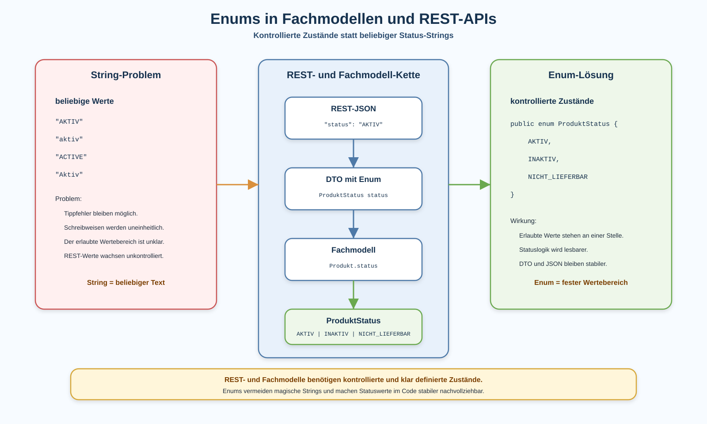

# Arbeitsblatt – Enums in Fachmodellen und REST-APIs

## Lernziele

- erklären, warum Statuswerte in Fachmodellen kontrolliert werden sollten
- typische Probleme von magischen Strings erkennen
- die Grundidee eines `enum` beschreiben
- einfache Enum-Werte lesen und fachlich einordnen
- ein `ProduktStatus`-Enum in einem Fachmodell einsetzen
- ein Enum-Feld in einem DTO verwenden
- die REST-/JSON-Darstellung von Enums erklären
- einfache `switch`-Entscheidungen mit Enums lesen
- Status, Kategorien und Typen als typische Enum-Einsatzgebiete erkennen
- begründen, wie Enums Lesbarkeit und Stabilität verbessern

---

## Ausgangslage

Die bekannte REST-Lagerverwaltung verwendet bereits DTOs, Collections und Streams.

Ein REST-Endpunkt liefert zum Beispiel Produkte als JSON:

```json
{
  "id": 1,
  "name": "Tastatur",
  "preis": 49.9
}
```

Jetzt soll sichtbar werden, ob ein Produkt aktiv, inaktiv oder nicht mehr lieferbar ist.

Eine einfache Lösung wäre ein String:

```java
private String status;
```

Das wirkt zuerst praktisch. Mit der Zeit entsteht aber ein Problem:

```text
Statuswerte sind fachliche Zustände.
Fachliche Zustände sollen nicht beliebige Texte sein.
```



---

## Problem: magische Strings

Ein magischer String ist ein Textwert, der im Code eine fachliche Bedeutung hat.

Beispiele:

```java
produkt.setStatus("AKTIV");
produkt.setStatus("aktiv");
produkt.setStatus("ACTIVE");
produkt.setStatus("Aktiv");
```

Für Menschen ist ungefähr klar, was gemeint ist. Für Java sind das aber vier verschiedene Strings.

Typische Probleme:

| Problem | Wirkung |
|---|---|
| Tippfehler | Fehler wird oft erst zur Laufzeit sichtbar |
| Gross-/Kleinschreibung | gleiche Bedeutung, unterschiedliche Werte |
| verschiedene Begriffe | API wird uneinheitlich |
| kein fester Wertebereich | jeder beliebige Text ist möglich |
| schwerere Wartung | niemand sieht sofort alle erlaubten Werte |

Magische Strings sind besonders kritisch, wenn sie über REST nach aussen sichtbar werden.

---

## Kontrollierte Wertebereiche

Ein kontrollierter Wertebereich legt fest, welche Werte erlaubt sind.

Beispiel für Produkte:

```text
AKTIV
INAKTIV
NICHT_LIEFERBAR
```

Andere typische Beispiele:

| Einsatzgebiet | Beispiele |
|---|---|
| Status | `OFFEN`, `ERLEDIGT`, `STORNIERT` |
| Kategorien | `HARDWARE`, `SOFTWARE`, `ZUBEHOER` |
| Typen | `STANDARD`, `PREMIUM`, `INTERN` |

Die Kernidee:

```text
Wenn nur wenige fachliche Werte erlaubt sind, soll der Code diese Werte sichtbar begrenzen.
```

---

## Enum-Grundidee

Ein `enum` beschreibt eine feste Auswahl von Werten.

```java
public enum ProduktStatus {
    AKTIV,
    INAKTIV,
    NICHT_LIEFERBAR
}
```

Damit sind genau diese Werte erlaubt.

Ein Status ist nicht mehr irgendein Text:

```java
private ProduktStatus status;
```

Der Code sagt jetzt deutlicher:

```text
Dieses Produkt hat einen Status aus dem Wertebereich ProduktStatus.
```

---

## Enums im Fachmodell

Vorher:

```java
public class Produkt {

    private Long id;
    private String name;
    private double preis;
    private String status;
}
```

Nachher:

```java
public class Produkt {

    private Long id;
    private String name;
    private double preis;
    private ProduktStatus status;
}
```

Ein möglicher Konstruktor:

```java
public Produkt(Long id, String name, double preis, ProduktStatus status) {
    this.id = id;
    this.name = name;
    this.preis = preis;
    this.status = status;
}
```

Dadurch wird der Status fachlich klarer. Der Code verwendet nicht mehr irgendeinen String, sondern einen definierten Zustand.

---

## Enums in DTOs

Wenn der Status zur REST-Ausgabe gehört, kann das Response-DTO den Enum-Wert enthalten.

```java
public record ProduktResponseDto(
        Long id,
        String name,
        double preis,
        ProduktStatus status
) {
}
```

Das Mapping bleibt einfach:

```java
private ProduktResponseDto toResponseDto(Produkt produkt) {
    return new ProduktResponseDto(
            produkt.getId(),
            produkt.getName(),
            produkt.getPreis(),
            produkt.getStatus()
    );
}
```

Wichtig:

```text
Das DTO entscheidet weiterhin, welche Daten über REST sichtbar sind.
Das Enum entscheidet, welche Statuswerte fachlich erlaubt sind.
```

---

## REST-/JSON-Darstellung von Enums

Spring Boot stellt einfache Enum-Werte in JSON normalerweise als String dar.

Java:

```java
ProduktStatus.AKTIV
```

JSON:

```json
{
  "id": 1,
  "name": "Tastatur",
  "preis": 49.9,
  "status": "AKTIV"
}
```

Für Clients sieht der Status also weiterhin wie ein Text aus. Der Unterschied liegt im Java-Code:

```text
Intern ist der Status kontrolliert.
Extern erscheint er als stabiler JSON-Wert.
```

Für diese Einheit genügt diese Standarddarstellung. Spezielle Serializer, Übersetzungen oder Labels gehören nicht hierher.

---

## `switch` mit Enums

Enums eignen sich gut für einfache Entscheidungen.

```java
public String beschreibungFuer(ProduktStatus status) {
    return switch (status) {
        case AKTIV -> "Produkt ist sichtbar";
        case INAKTIV -> "Produkt ist ausgeblendet";
        case NICHT_LIEFERBAR -> "Produkt ist aktuell nicht lieferbar";
    };
}
```

Das ist lesbarer als mehrere String-Vergleiche:

```java
if ("AKTIV".equals(status)) {
    return "Produkt ist sichtbar";
}
```

Die Entscheidung basiert auf einem kontrollierten Wertebereich.

---

## Enums und Streams

Enums können auch in Stream-Filtern verwendet werden.

```java
return produkte.stream()
        .filter(produkt -> produkt.getStatus() == ProduktStatus.AKTIV)
        .map(produkt -> toResponseDto(produkt))
        .toList();
```

Dabei bleibt die Stream-Idee gleich:

```text
Produkte laden.
Produkte nach Status auswählen.
Produkte in DTOs transformieren.
DTO-Liste als JSON zurückgeben.
```

Der Vergleich mit `==` ist bei Enum-Werten üblich und klar lesbar.

---

## Lesbarkeit und Stabilität

Enums verbessern Code nicht, weil sie neu oder kompliziert sind. Sie verbessern Code, weil sie fachliche Werte sichtbar begrenzen.

Vorteile:

- erlaubte Werte stehen an einer Stelle
- Tippfehler werden früher sichtbar
- Code ist besser lesbar
- REST-Werte bleiben stabiler
- Fachmodelle drücken Zustände klarer aus

Grenze:

```text
Ein Enum soll nicht zu einer komplizierten Zustandsmaschine werden.
```

In dieser Einheit bleibt `ProduktStatus` ein einfacher kontrollierter Wertebereich.

---

## Typische Fehler

| Fehlerbild | Warum es problematisch ist |
|---|---|
| weiter Strings statt Enums verwenden | der Wertebereich bleibt unkontrolliert |
| Enum-Werte mit Strings vergleichen | die Enum-Idee wird umgangen |
| Enums mit Methoden überladen | das Lernziel wird unnötig komplex |
| Fachlogik ins Enum verschieben | Verantwortlichkeiten werden unklar |
| JSON-Status als beliebigen Text interpretieren | REST-Werte wirken stabiler, als sie sind |
| ungültige Werte nicht beachten | fehlerhafte Requests werden später schwerer einzuordnen |
| Statuslogik unkontrolliert erweitern | aus einfachen Zuständen wird eine unklare Zustandsmaschine |

---

## Reflexion

Beantworte kurz:

- Welche Statuswerte sind in deiner Lagerverwaltung fachlich wirklich erlaubt?
- Wo wäre ein String für Statuswerte gefährlich?
- Welche Klasse soll den Status speichern?
- Welches DTO soll den Status über REST sichtbar machen?
- Warum profitieren REST-Clients von stabilen Statuswerten?

---

## Nicht-Ziele

Diese Einheit behandelt bewusst nicht:

- komplexe Enum-Methoden
- persistierte Enums
- Jackson-Custom-Serializer
- internationale Enum-Labels
- Enum-Interfaces
- JPA-Enum-Mapping
- komplexe Zustandsmaschinen
- vollständige Validation
- strukturierte REST-Fehlerbehandlung
