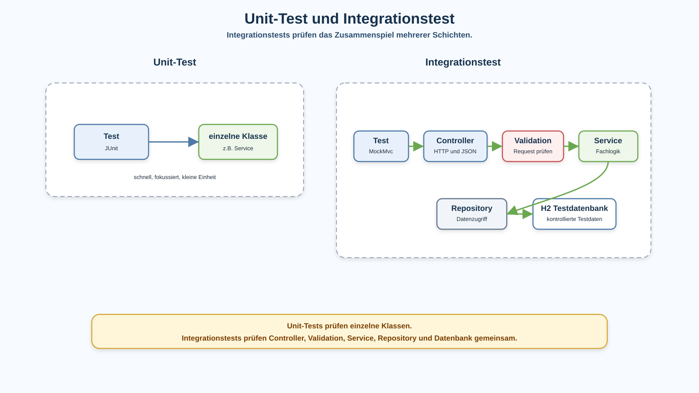

# Arbeitsblatt – Integrationstests

## Lernziele

- Unit-Tests und Integrationstests unterscheiden
- erklären, warum Integrationstests mehrere Schichten gemeinsam prüfen
- REST-Abläufe mit Spring Boot automatisiert testen
- erfolgreiche Requests und Fehlerfälle als Tests formulieren
- `@SpringBootTest`, MockMvc und H2 im Testkontext einordnen
- Statuscodes, JSON-Antworten und Datenbankzustand gezielt prüfen
- Testbarkeit als Qualitätsmerkmal sauberer Architektur begründen

---

## Ausgangslage

Die REST-Lagerverwaltung wurde Schritt für Schritt aufgebaut:

```text
Controller -> Service -> Repository -> Datenbank
```

Dazu kamen:

- DTOs
- Validation
- Fehlerbehandlung
- `Optional`
- Spring DI und Spring Container
- JPA und Spring Data

Bisher konnten REST-Abläufe mit Bruno oder `curl` geprüft werden. Das ist hilfreich, aber bei jeder Änderung alle Fälle manuell zu testen ist fehleranfällig.

Integrationstests automatisieren solche Prüfungen.

Die Codebeispiele in dieser Einheit beziehen sich auf die Zielstruktur nach der JPA-/Spring-Data-Einführung: Repositorys arbeiten mit Spring Data und die Tests verwenden eine H2-Testdatenbank.



---

## Unit-Test und Integrationstest

Ein Unit-Test prüft eine kleine Einheit möglichst isoliert. Oft ist das eine einzelne Klasse oder eine einzelne Methode.

Beispiel:

```text
ProduktServiceTest prüft eine Service-Methode.
```

Ein Integrationstest prüft, ob mehrere Teile zusammenarbeiten.

Beispiel:

```text
Ein POST-Request läuft durch Controller, Validation, Service, Repository und H2-Datenbank.
```

| Testart | Prüft | Typische Frage |
|---|---|---|
| Unit-Test | einzelne Klasse oder Methode | Funktioniert diese Logik für sich? |
| Integrationstest | mehrere Schichten gemeinsam | Funktioniert der Ablauf durch die Anwendung? |

Beide Testarten sind sinnvoll. Integrationstests ersetzen Unit-Tests nicht.

---

## Was ein REST-Integrationstest prüft

Ein REST-Integrationstest kann diesen Ablauf prüfen:

```text
Test
  -> HTTP Request
  -> Controller
  -> DTO / Validation
  -> Service
  -> Repository
  -> H2 Testdatenbank
```

Dabei wird nicht nur eine Methode geprüft. Der Test zeigt, ob die Verdrahtung und das Zusammenspiel funktionieren.

Typische Prüfungen:

- Welcher HTTP-Statuscode kommt zurück?
- Hat die JSON-Antwort die erwarteten Felder?
- Wird Validation angewendet?
- Wird die Fehlerantwort kontrolliert zurückgegeben?
- Wurde ein Datensatz wirklich gespeichert?

---

## Spring Boot Test

Mit `@SpringBootTest` startet Spring für den Test einen Anwendungskontext.

```java
@SpringBootTest
@AutoConfigureMockMvc
class ProduktIntegrationTest {
}
```

Das bedeutet:

- Spring erstellt die benötigten Beans.
- Constructor Injection funktioniert wie in der Anwendung.
- Controller, Service und Repository können gemeinsam verwendet werden.
- Der Test ist automatisiert und mit Maven ausführbar.

Die Details des Spring-Testsystems werden hier bewusst nicht vertieft.

---

## MockMvc

In dieser Einheit verwenden wir MockMvc.

MockMvc kann HTTP-Requests an die Spring-MVC-Schicht simulieren, ohne dass ein echter Serverprozess auf einem Port gestartet werden muss.

MockMvc ist in dieser Einheit kein Ersatz für Mockito. Wir ersetzen keine Services oder Repositorys durch Mocks, sondern lassen den Request bewusst durch die echten Spring-Komponenten laufen.

Ein einfacher GET-Test sieht so aus:

```java
@Autowired
private MockMvc mockMvc;

@Test
void gibtProduktlisteZurueck() throws Exception {
    mockMvc.perform(get("/produkte"))
            .andExpect(status().isOk())
            .andExpect(jsonPath("$").isArray());
}
```

Wichtig:

- `perform(...)` führt den Request aus.
- `status().isOk()` prüft den HTTP-Statuscode `200`.
- `jsonPath(...)` prüft Teile der JSON-Antwort.
- Controller, Validation, Service und Repository bleiben im Testablauf beteiligt.

---

## H2 Testdatenbank

Integrationstests sollen nicht von Produktionsdaten abhängen.

Für Lernprojekte eignet sich H2 als Testdatenbank:

- schnell startbar
- lokal und kontrollierbar
- gut mit Spring Boot kombinierbar
- passend für automatisierte Tests

Typisch ist eine Testkonfiguration, in der die Anwendung für Tests eine H2-Datenbank nutzt. So können Repository und JPA/Spring Data real mitgeprüft werden.

```text
Repository -> Spring Data JPA -> H2 Testdatenbank
```

---

## Erfolgsfälle testen

Ein Erfolgsfall prüft, ob ein gültiger Request korrekt verarbeitet wird.

Beispiel: gültiges Produkt erstellen.

```java
@Test
void erstelltProduktMitGueltigemRequest() throws Exception {
    String json = """
            {
              "name": "Tastatur",
              "preis": 49.90,
              "status": "AKTIV"
            }
            """;

    mockMvc.perform(post("/produkte")
                    .contentType(MediaType.APPLICATION_JSON)
                    .content(json))
            .andExpect(status().isCreated())
            .andExpect(jsonPath("$.name").value("Tastatur"))
            .andExpect(jsonPath("$.status").value("AKTIV"));
}
```

Dieser Test prüft mehr als nur den Controller:

- JSON wird entgegengenommen.
- DTO und Mapping werden verwendet.
- Service wird aufgerufen.
- Repository speichert.
- Antwort wird als JSON zurückgegeben.

---

## Fehlerfälle testen

Fehlerfälle sind genauso wichtig wie Erfolgsfälle.

Beispiel: ungültiges Produkt ohne Namen.

```java
@Test
void lehntUngueltigenRequestAb() throws Exception {
    String json = """
            {
              "name": "",
              "preis": 49.90,
              "status": "AKTIV"
            }
            """;

    mockMvc.perform(post("/produkte")
                    .contentType(MediaType.APPLICATION_JSON)
                    .content(json))
            .andExpect(status().isBadRequest());
}
```

Wenn die Anwendung eine Fehlerantwort als JSON zurückgibt, sollte auch diese geprüft werden.

```java
.andExpect(jsonPath("$.message").exists())
```

Nur der Statuscode ist oft zu wenig. Der Client braucht auch eine verständliche Antwortstruktur.

---

## Datenbankzustand prüfen

Manchmal reicht die JSON-Antwort nicht aus. Dann kann zusätzlich geprüft werden, ob die Daten wirklich gespeichert wurden.

```java
@Autowired
private ProduktRepository produktRepository;

@Test
void speichertProduktInDerDatenbank() throws Exception {
    String json = """
            {
              "name": "Maus",
              "preis": 24.90,
              "status": "AKTIV"
            }
            """;

    mockMvc.perform(post("/produkte")
                    .contentType(MediaType.APPLICATION_JSON)
                    .content(json))
            .andExpect(status().isCreated());

    assertThat(produktRepository.findAll())
            .anyMatch(produkt -> produkt.getName().equals("Maus"));
}
```

Damit wird sichtbar: Der REST-Request hat nicht nur eine Antwort erzeugt, sondern den Persistenzzustand verändert.

---

## Testbarkeit als Qualitätsmerkmal

Eine Anwendung ist leichter testbar, wenn die Architektur sauber ist.

Hilfreich sind:

- klare Schichten
- Constructor Injection
- keine direkte Objekterzeugung mit `new` im Controller
- DTOs für REST-Daten
- Validation an der Eingabegrenze
- Service für Fachlogik
- Repository für Datenzugriff

Integrationstests machen sichtbar, ob diese Teile zusammenpassen.

---

## Typische Missverständnisse

### Integrationstest ist dasselbe wie Unit-Test

Nein. Ein Unit-Test prüft eine kleine Einheit. Ein Integrationstest prüft das Zusammenspiel mehrerer Teile.

### Nur Statuscode prüfen genügt

Nicht immer. Ein `200 OK` kann trotzdem eine falsche JSON-Struktur enthalten. Wichtige Felder und Fehlerantworten sollten mitgeprüft werden.

### Die Datenbank muss nicht geprüft werden

Bei REST-Abläufen mit Persistenz sollte mindestens in wichtigen Fällen geprüft werden, ob Daten gespeichert oder geladen werden.

### Der REST-Endpunkt alleine genügt

Ein Endpunkt ist nur der Eingang. Der eigentliche Ablauf geht über Service, Repository und Datenbank weiter.

### Integrationstests ersetzen saubere Architektur

Nein. Tests helfen, Architekturprobleme zu erkennen. Sie ersetzen klare Verantwortlichkeiten nicht.

---

## Nicht-Ziele dieser Einheit

Diese Einheit behandelt bewusst noch nicht:

- Mockito
- Mocking-Strategien
- Testcontainer
- Docker
- WireMock
- Performance-Tests
- Security-Tests
- externe Services
- Browser-End-to-End-Tests
- komplexe Testprofile
- parallele Testausführung

---

## Reflexion

- Welche Fehler kann ein Integrationstest finden, die ein reiner Unit-Test nicht findet?
- Warum ist es sinnvoll, auch Fehlerfälle automatisiert zu prüfen?
- Wie hilft eine klare Architektur beim Schreiben von Integrationstests?
