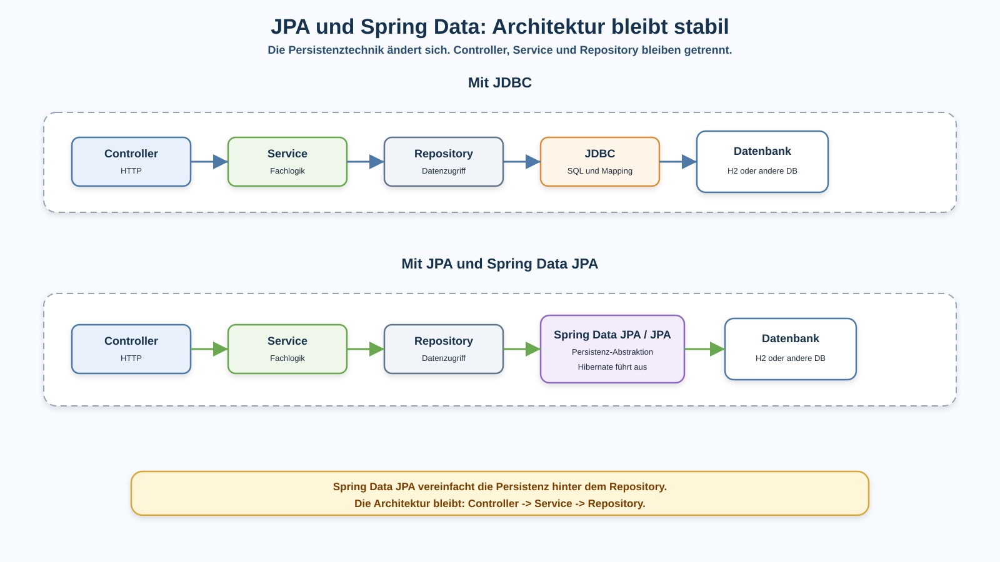
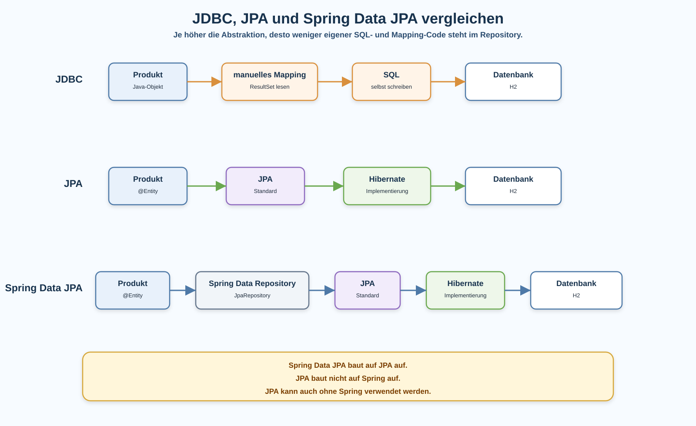

# Arbeitsblatt – JPA und Spring Data Grundlagen

## Lernziele

- erklären, warum JDBC funktioniert, aber bei mehreren Tabellen und Fachobjekten viel SQL-, Mapping- und Boilerplate-Code erzeugt
- JPA als Java-Standard für Objekt-Persistenz einordnen
- Hibernate als konkrete JPA-Implementierung erklären
- Spring Data JPA als Spring-Integration auf Basis von JPA beschreiben
- `@Entity`, `@Id`, `@GeneratedValue` und `JpaRepository` in einfachen Beispielen erkennen
- die Architektur `Controller -> Service -> Repository` trotz JPA und Spring Data beibehalten
- begründen, warum Persistenz abstrahiert wird, ohne dass Fachlogik ins Repository wandert

---

## Ausgangslage

Die REST-Lagerverwaltung hat bereits eine klare Struktur:

```text
Controller -> Service -> Repository
```

Das Repository kapselt den Datenzugriff. Bisher konnte dieser Datenzugriff zum Beispiel mit Listen, Dateien, CSV oder JDBC umgesetzt werden.

Bei JDBC ist sehr gut sichtbar, was passiert:

- SQL wird selbst geschrieben.
- Parameter werden selbst gesetzt.
- Ergebnisse werden aus dem `ResultSet` gelesen.
- Java-Objekte werden manuell gebaut.
- Fehlerbehandlung und Verbindungslogik erzeugen zusätzlichen Code.

Das ist kontrollierbar, aber auf Dauer aufwendig.



---

## JDBC: direkt, aber viel Mapping-Aufwand

Ein vereinfachter JDBC-Ausschnitt kann so aussehen:

```java
String sql = "select id, name, preis from produkte where id = ?";

PreparedStatement statement = connection.prepareStatement(sql);
statement.setLong(1, id);

ResultSet resultSet = statement.executeQuery();

if (resultSet.next()) {
    Produkt produkt = new Produkt(
            resultSet.getLong("id"),
            resultSet.getString("name"),
            resultSet.getBigDecimal("preis")
    );
}
```

Der Code zeigt mehrere Aufgaben gleichzeitig:

| Aufgabe | Beispiel |
|---|---|
| SQL formulieren | `select id, name, preis from produkte` |
| Parameter setzen | `statement.setLong(1, id)` |
| Ergebnis lesen | `resultSet.getString("name")` |
| Objekt bauen | `new Produkt(...)` |

Das Problem ist nicht, dass JDBC falsch ist. JDBC funktioniert. Das Problem ist der wiederkehrende technische Aufwand zwischen Tabelle und Java-Objekt.

---

## Objektwelt und Tabellenwelt

In Java arbeiten wir mit Objekten:

```java
public class Produkt {

    private Long id;
    private String name;
    private BigDecimal preis;
}
```

In der Datenbank liegen Daten in Tabellen:

```text
produkte
------------------------------------------------
id | name              | preis
1  | Tastatur          | 49.90
2  | Maus              | 24.90
```

Die Anwendung möchte mit `Produkt`-Objekten arbeiten. Die Datenbank speichert Zeilen. Persistenz braucht also eine Übersetzung zwischen Objekt und Tabelle.

---

## JPA ist ein Java-Standard

JPA steht für Java Persistence API. In aktuellen Spring-Boot-Projekten werden die Annotationen meist aus `jakarta.persistence` importiert. Die Grundidee bleibt: JPA beschreibt, wie Java-Objekte dauerhaft gespeichert und wieder geladen werden können.

Wichtig:

- JPA ist ein Standard.
- JPA ist nicht Spring.
- JPA kann auch ohne Spring verwendet werden.
- JPA definiert Konzepte und Annotationen, zum Beispiel `@Entity`, `@Id` und `@GeneratedValue`.

Ein einfaches persistentes Fachobjekt kann so aussehen:

```java
import jakarta.persistence.Entity;
import jakarta.persistence.GeneratedValue;
import jakarta.persistence.GenerationType;
import jakarta.persistence.Id;

@Entity
public class Produkt {

    @Id
    @GeneratedValue(strategy = GenerationType.IDENTITY)
    private Long id;

    private String name;
    private BigDecimal preis;

    protected Produkt() {
    }

    public Produkt(String name, BigDecimal preis) {
        this.name = name;
        this.preis = preis;
    }
}
```

| Element | Bedeutung |
|---|---|
| `@Entity` | Diese Klasse kann persistent gespeichert werden |
| `@Id` | Dieses Feld ist der Primärschlüssel |
| `@GeneratedValue` | Die ID wird automatisch erzeugt |
| leerer Konstruktor | JPA braucht ihn zum Erzeugen von Objekten |

JPA macht aus einem Fachobjekt kein DTO. Ein Entity gehört zur Persistenz- und Fachmodellseite, nicht direkt zur öffentlichen API-Struktur.

---

## Hibernate ist eine JPA-Implementierung

JPA beschreibt den Standard. Eine konkrete Bibliothek muss diesen Standard ausführen.

Hibernate ist eine solche JPA-Implementierung.

Hibernate übernimmt in diesem Zusammenspiel die konkrete Arbeit. Hibernate kann zum Beispiel:

- JPA-Annotationen lesen
- SQL für die Datenbank erzeugen oder ausführen
- Objekte aus Datenbankzeilen aufbauen
- Änderungen an Entities speichern

Wichtig:

```text
Hibernate ist nicht JPA.
Hibernate implementiert JPA.
```

In vielen Spring-Boot-Projekten ist Hibernate die verwendete JPA-Implementierung.

---

## Spring Data JPA ist Spring-Integration

Spring Data JPA baut auf JPA auf und integriert JPA in Spring Boot.

Statt ein Repository komplett selbst zu schreiben, wird häufig ein Interface definiert:

```java
import org.springframework.data.jpa.repository.JpaRepository;

public interface ProduktRepository extends JpaRepository<Produkt, Long> {
}
```

`JpaRepository<Produkt, Long>` bedeutet:

| Teil | Bedeutung |
|---|---|
| `Produkt` | Entity-Typ, der gespeichert wird |
| `Long` | Typ der ID |

Damit stehen einfache Datenzugriffe bereit, zum Beispiel:

- `findAll()`
- `findById(id)`
- `save(produkt)`
- `deleteById(id)`

Spring Data JPA ist nicht die Datenbank. Es ist auch nicht JPA selbst. Es ist eine Spring-nahe Vereinfachung für Repositorys, die JPA verwendet.



---

## Architektur bleibt Controller -> Service -> Repository

Auch mit Spring Data JPA bleibt die bekannte Struktur erhalten:

```text
ProduktController -> ProduktService -> ProduktRepository -> Datenbank
```

Der Controller verarbeitet HTTP:

```java
@RestController
public class ProduktController {

    private final ProduktService produktService;

    public ProduktController(ProduktService produktService) {
        this.produktService = produktService;
    }
}
```

Der Service bleibt für Fachlogik und Abläufe zuständig:

```java
@Service
public class ProduktService {

    private final ProduktRepository produktRepository;

    public ProduktService(ProduktRepository produktRepository) {
        this.produktRepository = produktRepository;
    }

    public Produkt erfassen(String name, BigDecimal preis) {
        Produkt produkt = new Produkt(name, preis);
        return produktRepository.save(produkt);
    }
}
```

Das Repository kapselt den Datenzugriff:

```java
public interface ProduktRepository extends JpaRepository<Produkt, Long> {
}
```

Spring Data JPA vereinfacht also die technische Umsetzung im Repository. Es ersetzt nicht die Rollen von Controller, Service und Repository.

---

## H2 im Lernkontext

H2 ist eine kleine Datenbank, die sich gut für Lern- und Testprojekte eignet.

Typische Rolle in dieser Einheit:

- Die Anwendung bleibt eine Spring-Boot-Anwendung.
- Die Daten werden nicht mehr nur in einer Liste gehalten.
- JPA/Hibernate speichert Entities in H2.
- Spring Data JPA stellt Repository-Methoden bereit.

H2 ist dabei nur die konkrete Datenbank für die Übung. Die Kernidee ist die Abstraktion der Persistenz.

---

## Zentrale Einordnung

```text
Spring Data JPA baut auf JPA auf.
JPA baut nicht auf Spring auf.
```

Kurzvergleich:

| Begriff | Rolle |
|---|---|
| JDBC | direkter Datenbankzugriff mit SQL und manuellem Mapping |
| JPA | Java-Standard für Objekt-Persistenz |
| Hibernate | konkrete Implementierung von JPA |
| Spring Data JPA | Spring-Integration und Repository-Abstraktion über JPA |
| H2 | konkrete Datenbank für Übungen und Tests |

---

## Typische Missverständnisse

### JPA ist Spring

Nein. JPA ist ein Java-Standard. Spring Data JPA nutzt JPA, aber JPA kann auch ohne Spring verwendet werden.

### Hibernate ist JPA

Nein. Hibernate ist eine Implementierung von JPA. JPA beschreibt die Regeln, Hibernate führt sie konkret aus.

### Spring Data JPA ersetzt die Architektur

Nein. Controller, Service und Repository bleiben bestehen. Spring Data JPA vereinfacht nur den Datenzugriff im Repository.

### Das Repository darf jetzt Fachlogik enthalten

Nein. Fachlogik gehört weiterhin in den Service. Das Repository bleibt für Datenzugriff zuständig.

### Entities sind automatisch gute REST-DTOs

Nein. Entities beschreiben persistente Fachobjekte. DTOs beschreiben die öffentliche API-Struktur. Diese Rollen bleiben getrennt.

---

## Nicht-Ziele dieser Einheit

Diese Einheit behandelt bewusst noch nicht:

- `EntityManager`
- Persistence Context
- Lazy Loading
- `FetchType`
- Cascade
- Transaktionen im Detail
- JPQL
- Criteria API
- komplexe Beziehungen
- komplexe Datenbankmodellierung
- Performance-Optimierung

---

## Reflexion

- Wo spart Spring Data JPA im Vergleich zu JDBC sichtbaren Code?
- Warum ist es trotzdem wichtig, die Architektur `Controller -> Service -> Repository` beizubehalten?
- Warum ist die Aussage "Spring Data JPA baut auf JPA auf" präziser als "JPA ist Spring"?
