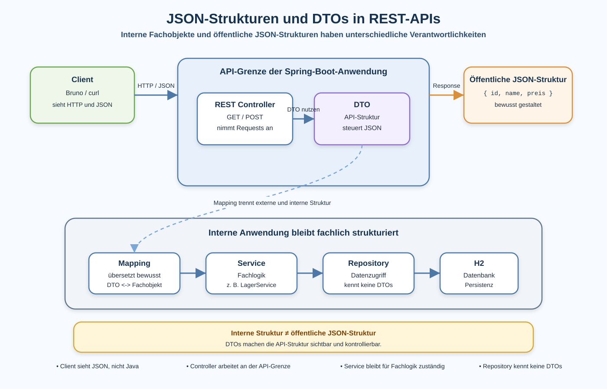

# Arbeitsblatt – JSON-Strukturen und DTOs in REST-APIs

## Lernziele

- interne Fachobjekte und externe REST-/JSON-Strukturen unterscheiden
- erklären, warum eine REST-API eine öffentliche Schnittstelle ist
- typische Probleme direkter Objektserialisierung erkennen
- die Grundidee eines DTO beschreiben
- einfache DTO-Klassen für REST-Ausgabe und REST-Eingabe lesen
- manuelles Mapping zwischen Fachobjekt und DTO nachvollziehen
- eine kontrollierte JSON-Ausgabe mit `GET` erklären
- eine kontrollierte JSON-Eingabe mit `POST` erklären
- Bruno und `curl` verwenden, um JSON-Strukturen zu prüfen

---

## Ausgangslage

Die bekannte Lagerverwaltung ist bereits über REST erreichbar:

```text
Client
-> HTTP / JSON
-> REST Controller
-> LagerService
-> ProduktRepository
-> JDBC / H2
```

In den bisherigen Einheiten hat der Controller vermutlich direkte Fachobjekte zurückgegeben:

```java
@GetMapping
public List<Produkt> alleProdukte() {
    return lagerService.alleProdukte();
}
```

Spring Boot wandelt diese Java-Objekte automatisch in JSON um. Das ist für den Einstieg praktisch.

Jetzt entsteht ein neues Problem:

```text
Die interne Java-Struktur ist nicht automatisch die richtige API-Struktur.
```



---

## REST als öffentliche Schnittstelle

Eine REST-API wird von Clients verwendet:

- Bruno
- `curl`
- Frontends
- andere Programme
- spätere Integrationen

Diese Clients sehen nicht deine Java-Klassen. Sie sehen HTTP und JSON.

Beispiel:

```json
{
  "id": 1,
  "name": "Tastatur",
  "preis": 49.9
}
```

Für Clients ist diese JSON-Struktur ein Vertrag:

```text
Wenn Feldnamen oder Strukturen ändern, kann Client-Code kaputtgehen.
```

Darum soll eine API nicht zufällig aus internen Klassen entstehen. Sie soll bewusst gestaltet werden.

---

## Interne Struktur und externe Struktur

Ein Fachobjekt gehört zur internen Anwendung.

Beispiel:

```java
public class Produkt {

    private Long id;
    private String name;
    private double preis;
    private String internerStatus;

    // Konstruktoren, Getter, Setter
}
```

Dieses Objekt kann für Fachlogik passend sein. Für die REST-Ausgabe ist es aber vielleicht zu detailliert.

Ein Client braucht eventuell nur:

```json
{
  "id": 1,
  "name": "Tastatur",
  "preis": 49.9
}
```

Der interne Status soll nicht öffentlich erscheinen.

Merke:

```text
Fachobjekt: intern arbeiten
JSON-Struktur: extern kommunizieren
```

---

## Problem direkter Objektserialisierung

Direkte Objektserialisierung bedeutet:

```text
Controller gibt Fachobjekt zurück.
Spring Boot macht daraus JSON.
```

Beispiel:

```java
@GetMapping
public List<Produkt> alleProdukte() {
    return lagerService.alleProdukte();
}
```

Mögliche Probleme:

| Problem | Wirkung |
|---|---|
| interne Felder werden sichtbar | Clients sehen Daten, die nicht zur API gehören |
| interne Feldnamen werden API-Feldnamen | Java-Änderungen verändern die REST-Schnittstelle |
| Fachobjekt wächst | JSON-Ausgabe wächst unkontrolliert mit |
| API-Struktur ist zufällig | Clients erhalten keine bewusst gestaltete Schnittstelle |
| spätere Änderungen werden schwierig | interne Refactorings können Clients brechen |

Direkte Objektserialisierung ist nicht immer sofort falsch. Sie ist aber gefährlich, sobald die API stabil und verständlich bleiben soll.

---

## DTO-Grundidee

DTO bedeutet:

```text
Data Transfer Object
```

Ein DTO ist ein einfaches Objekt für den Datentransport über eine Schnittstelle.

In dieser Einheit verwenden wir DTOs für REST:

```text
REST Controller
-> DTO
-> JSON
```

Ein DTO enthält keine Fachlogik. Es beschreibt, welche Daten über die API hinein- oder hinausgehen.

Beispiel für eine Ausgabe:

```java
package ch.allianz.youngoitv.lager.api.dto;

public class ProduktResponseDto {

    private Long id;
    private String name;
    private double preis;

    public ProduktResponseDto(Long id, String name, double preis) {
        this.id = id;
        this.name = name;
        this.preis = preis;
    }

    public Long getId() {
        return id;
    }

    public String getName() {
        return name;
    }

    public double getPreis() {
        return preis;
    }
}
```

Dieses DTO steuert, welche Felder als JSON ausgegeben werden.

---

## DTOs für Ausgabe und Eingabe

Eine REST-Ausgabe und eine REST-Eingabe haben oft unterschiedliche Aufgaben.

Ausgabe bei `GET /produkte`:

```json
{
  "id": 1,
  "name": "Tastatur",
  "preis": 49.9
}
```

Eingabe bei `POST /produkte`:

```json
{
  "name": "Maus",
  "preis": 24.9
}
```

Bei `POST` sendet der Client normalerweise keine ID. Die ID entsteht erst intern.

Darum sind zwei DTOs oft klarer:

```java
public class ProduktRequestDto {

    private String name;
    private double preis;

    public String getName() {
        return name;
    }

    public void setName(String name) {
        this.name = name;
    }

    public double getPreis() {
        return preis;
    }

    public void setPreis(double preis) {
        this.preis = preis;
    }
}
```

```java
public class ProduktResponseDto {

    private Long id;
    private String name;
    private double preis;

    // Konstruktor und Getter
}
```

Wichtig:

```text
Request-DTO: Was darf der Client senden?
Response-DTO: Was soll der Client sehen?
```

---

## Manuelles Mapping

Mapping bedeutet:

```text
Daten von einer Struktur in eine andere Struktur übertragen.
```

In dieser Einheit machen wir das bewusst manuell.

Beispiel:

```java
private ProduktResponseDto toResponseDto(Produkt produkt) {
    return new ProduktResponseDto(
            produkt.getId(),
            produkt.getName(),
            produkt.getPreis()
    );
}
```

Für eine Liste:

```java
@GetMapping
public List<ProduktResponseDto> alleProdukte() {
    List<Produkt> produkte = lagerService.alleProdukte();
    List<ProduktResponseDto> response = new ArrayList<>();

    for (Produkt produkt : produkte) {
        response.add(toResponseDto(produkt));
    }

    return response;
}
```

Der Controller gibt jetzt keine `Produkt`-Objekte mehr nach aussen zurück. Er gibt DTOs zurück.

Dafür reicht eine normale Schleife. Streams werden hier bewusst nicht verwendet.

Falls `ArrayList` noch nicht importiert ist, braucht der Controller zusätzlich:

```java
import java.util.ArrayList;
```

---

## POST mit DTO

Bei `POST` liest Spring Boot JSON aus dem Request Body.

Vorher:

```java
@PostMapping
public Produkt produktErstellen(@RequestBody Produkt produkt) {
    return lagerService.produktErstellen(produkt);
}
```

Problem:

```text
Der Client sendet direkt die interne Produkt-Struktur.
```

Mit DTO:

```java
@PostMapping
public ProduktResponseDto produktErstellen(@RequestBody ProduktRequestDto request) {
    Produkt produkt = new Produkt(request.getName(), request.getPreis());
    Produkt gespeichert = lagerService.produktErstellen(produkt);
    return toResponseDto(gespeichert);
}
```

Jetzt ist klarer:

- Der Client sendet ein Request-DTO.
- Intern arbeitet die Anwendung mit einem Fachobjekt.
- Die Antwort wird als Response-DTO zurückgegeben.

---

## JSON-Ausgabe kontrollieren

Mit DTOs kann die JSON-Ausgabe bewusst gestaltet werden.

Beispiel: Intern gibt es mehr Felder:

```java
Produkt
- id
- name
- preis
- internerStatus
```

Extern soll nur diese Struktur sichtbar sein:

```json
{
  "id": 1,
  "name": "Tastatur",
  "preis": 49.9
}
```

Das DTO entscheidet, was Teil der API ist.

```text
Nicht jedes interne Feld gehört automatisch in die öffentliche JSON-Struktur.
```

---

## Bruno und curl zum Prüfen

Mit `curl` kannst du die Ausgabe direkt sehen:

```bash
curl -i http://localhost:8080/produkte
```

Für `POST`:

```bash
curl -i -X POST http://localhost:8080/produkte \
  -H "Content-Type: application/json" \
  -d '{"name":"Maus","preis":24.9}'
```

In Bruno führst du dieselben Requests erneut aus und vergleichst:

- Statuscode
- Header
- JSON-Feldnamen
- sichtbare Felder
- Reihenfolge des Workflows

Wichtig:

```text
Prüfe nicht nur, ob der Request funktioniert.
Prüfe auch, ob die JSON-Struktur zur API passt.
```

---

## API-Design-Grundidee

API-Design bedeutet hier:

```text
Wir entscheiden bewusst, wie die REST-Schnittstelle von aussen aussieht.
```

Gute Fragen:

- Welche Felder braucht ein Client wirklich?
- Welche Feldnamen sind verständlich?
- Welche internen Details sollen nicht sichtbar sein?
- Ist die Struktur für `GET` und `POST` klar?
- Würde ein anderer Entwickler diese API verstehen?

DTOs helfen, diese Fragen im Code sichtbar zu machen.

---

## Typische Fehler

| Fehler | Problem |
|---|---|
| Fachobjekte direkt serialisieren | interne Struktur wird zur öffentlichen API |
| Fachlogik in DTOs verschieben | DTO übernimmt die falsche Verantwortung |
| DTOs unnötig komplex machen | Lernziel und API-Struktur werden unklar |
| Mapping im Repository durchführen | Datenzugriff und API-Struktur werden vermischt |
| interne technische Felder veröffentlichen | Clients sehen Details, die nicht für sie bestimmt sind |
| DTOs mit Datenbankstruktur vermischen | REST, Fachmodell und Persistenz werden gekoppelt |
| REST-Struktur unkontrolliert wachsen lassen | API wird schwer verständlich und schwer stabil zu halten |
| nur Statuscode prüfen | JSON-Struktur bleibt ungeprüft |

---

## Nicht-Ziele dieser Einheit

Bewusst noch nicht behandelt werden:

- MapStruct
- AutoMapper
- generische Mapping-Frameworks
- komplexe DTO-Hierarchien
- JPA
- Spring Data
- Lombok
- Bean Validation
- Security
- API-Versionierung
- OpenAPI oder Swagger
- globale Fehlerbehandlung
- komplexe Statuscode-Strategien

Diese Themen werden später sinnvoll, wenn die Trennung von interner Struktur und API-Struktur verstanden ist.

---

## Reflexion

Beantworte kurz:

1. Warum ist eine REST-API eine öffentliche Schnittstelle?
2. Warum ist ein Fachobjekt nicht automatisch eine gute JSON-Struktur?
3. Welche Aufgabe hat ein DTO?
4. Warum ist manuelles Mapping am Anfang hilfreich?
5. Welche Felder würdest du bei einer Produkt-API nicht veröffentlichen?
