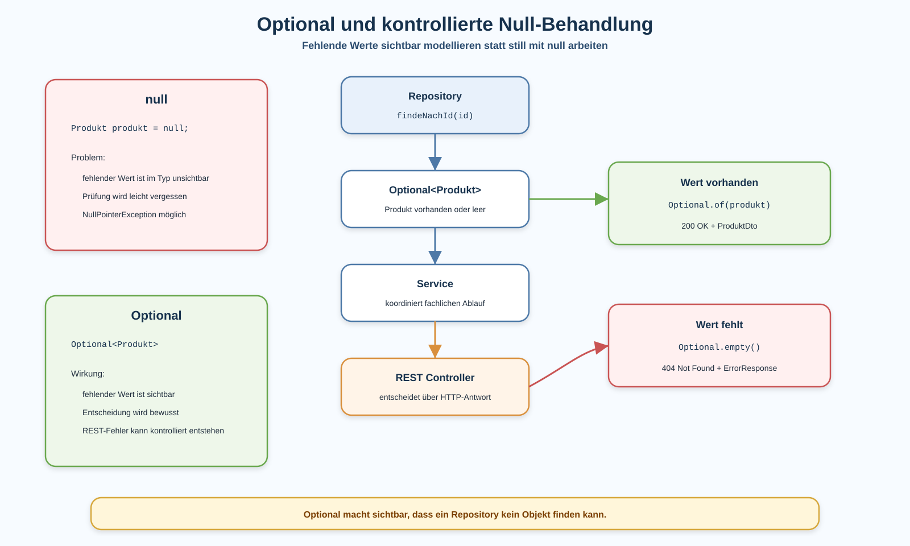

# Arbeitsblatt – Optional und kontrollierte Null-Behandlung

## Lernziele

- erklären, warum fehlende Werte in Java bewusst modelliert werden sollten
- typische Probleme von `null` und `NullPointerException` erkennen
- die Grundidee von `Optional<T>` beschreiben
- `Optional.empty()` und ein vorhandenes `Optional<Produkt>` fachlich einordnen
- `isPresent()` und `isEmpty()` in einfachen Entscheidungen verwenden
- `orElse()` und `orElseThrow()` in einfachen Service-Situationen lesen
- Repository, Service und REST Controller beim Umgang mit fehlenden Werten trennen
- `Optional` mit REST-Fehlerbehandlung und `ResponseEntity` verbinden

---

## Ausgangslage

Die REST-Lagerverwaltung kann Produkte lesen und Fehler kontrolliert zurückgeben.

Ein typischer Fehlerfall ist:

```text
GET /produkte/999
```

Die ID `999` existiert nicht. Das Repository findet also kein Produkt.

Früher wurde für solche Fälle oft `null` verwendet:

```java
public Produkt findeNachId(Long id) {
    // gibt Produkt oder null zurück
}
```

Das Problem:

```text
Am Rückgabetyp sieht niemand, dass kein Produkt möglich ist.
```



---

## Problem mit `null`

`null` bedeutet: Hier zeigt die Variable auf kein Objekt.

Das ist manchmal praktisch, aber gefährlich:

```java
Produkt produkt = produktRepository.findeNachId(999L);
return produkt.getName();
```

Wenn `produkt` `null` ist, entsteht eine `NullPointerException`.

Typische Probleme:

| Problem | Wirkung |
|---|---|
| fehlender Wert ist unsichtbar | Aufrufer prüft nicht auf `null` |
| Bedeutung ist unklar | nicht gefunden, noch nicht gesetzt oder Fehler? |
| Fehler kommt spät | Problem wird erst zur Laufzeit sichtbar |
| REST-Antwort wird unkontrolliert | aus fachlichem Fehler wird leicht `500` |

Die Kernidee dieser Einheit:

```text
Fehlende Werte sollen sichtbar und kontrolliert modelliert werden.
```

---

## Optional-Grundidee

`Optional<T>` beschreibt:

```text
Es kann ein Wert vom Typ T vorhanden sein.
Es kann aber auch kein Wert vorhanden sein.
```

Beispiel:

```java
Optional<Produkt> produkt = produktRepository.findeNachId(1L);
```

Das Methodensignal ist klarer:

```java
public Optional<Produkt> findeNachId(Long id) {
    // Produkt vorhanden oder leer
}
```

Damit sieht der Aufrufer sofort:

```text
Ich muss den Fall "kein Produkt" behandeln.
```

---

## Optional im Repository

Ein Repository sucht Daten. Bei einer Suche nach ID kann es sein, dass kein Objekt existiert.

In der Lagerverwaltung ist deshalb diese Signatur passend:

```java
public Optional<Produkt> findeNachId(Long id) {
    return produkte.stream()
            .filter(produkt -> produkt.getId().equals(id))
            .findFirst();
}
```

`findFirst()` liefert bereits ein `Optional<Produkt>`.

Wichtig:

```text
Für ein einzelnes gesuchtes Objekt ist Optional passend.
Für eine Liste ist meist eine leere Liste besser.
```

Beispiel:

```java
public List<Produkt> alle() {
    return new ArrayList<>(produkte);
}
```

Eine leere Produktliste ist kein Fehler. Sie ist einfach eine Liste ohne Elemente.

---

## Prüfen mit `isPresent()` und `isEmpty()`

Für den Einstieg sind einfache `if`-Abfragen gut lesbar.

```java
Optional<Produkt> produkt = produktRepository.findeNachId(id);

if (produkt.isPresent()) {
    Produkt gefundenesProdukt = produkt.get();
    // mit Produkt weiterarbeiten
}
```

Oder für den Fehlerfall:

```java
Optional<Produkt> produkt = produktRepository.findeNachId(id);

if (produkt.isEmpty()) {
    // Produkt fehlt
}
```

Wichtig:

```text
get() nur verwenden, wenn vorher geprüft wurde, dass ein Wert vorhanden ist.
```

---

## `orElse()`

`orElse()` liefert einen Ersatzwert, falls das `Optional` leer ist.

Ein kleines Beispiel:

```java
Produkt ersatzProdukt = new Produkt(0L, "Unbekanntes Produkt", 0.0, ProduktStatus.ARCHIVIERT);

Produkt anzeigeProdukt = produktRepository.findeNachId(id)
        .orElse(ersatzProdukt);
```

Für diese Einheit genügt die Idee:

```text
Wenn Wert vorhanden: nimm den Wert.
Wenn kein Wert vorhanden: nimm den Ersatzwert.
```

In der REST-Lagerverwaltung ist `orElse()` nicht immer die beste Lösung. Wenn ein Produkt per ID fehlt, soll oft kein Ersatzprodukt entstehen, sondern ein `404 Not Found`.

---

## `orElseThrow()`

`orElseThrow()` ist passend, wenn ein fehlender Wert als klarer Fehler behandelt werden soll.

Beispiel im Service:

```java
public Produkt statusAendern(Long id, ProduktStatus status) {
    Produkt produkt = produktRepository.findeNachId(id)
            .orElseThrow(() -> new IllegalArgumentException("Produkt nicht gefunden: " + id));

    produkt.setStatus(status);
    return produkt;
}
```

Das ist kurz, aber die Entscheidung muss bewusst sein.

Für Lernende ist die Frage wichtig:

```text
Ist "nicht gefunden" ein normaler REST-Fall mit 404?
Oder ist es an dieser Stelle ein fachlicher Fehler im Service?
```

---

## Optional im Service

Der Service koordiniert fachliche Abläufe.

Eine einfache Service-Methode kann `Optional` weitergeben:

```java
public Optional<Produkt> findeProdukt(Long id) {
    return produktRepository.findeNachId(id);
}
```

Das ist gut lesbar, wenn der Controller später über `200` oder `404` entscheidet.

Bei einer Änderung kann der Service auch selbst entscheiden:

```java
public Produkt statusAendern(Long id, ProduktStatus status) {
    Produkt produkt = produktRepository.findeNachId(id)
            .orElseThrow(() -> new IllegalArgumentException("Produkt nicht gefunden: " + id));

    produkt.setStatus(status);
    return produkt;
}
```

Wichtig:

```text
Der Service soll keine ResponseEntity bauen.
HTTP gehört in den Controller.
```

---

## Optional im REST Controller

Der Controller übersetzt fachliche Ergebnisse in REST-Antworten.

```java
@GetMapping("/{id}")
public ResponseEntity<Object> produktNachId(@PathVariable Long id) {
    Optional<Produkt> produkt = produktService.findeProdukt(id);

    if (produkt.isPresent()) {
        return ResponseEntity.ok(toDto(produkt.get()));
    }

    ErrorResponse error = new ErrorResponse(
            "PRODUCT_NOT_FOUND",
            "Produkt wurde nicht gefunden.",
            "id=" + id
    );

    return ResponseEntity.status(HttpStatus.NOT_FOUND).body(error);
}
```

Die Verbindung zur REST-Fehlerbehandlung:

```text
Optional enthält Produkt -> 200 OK + ProduktDto
Optional ist leer -> 404 Not Found + ErrorResponse
```

---

## Typische Fehler

| Fehlerbild | Problem |
|---|---|
| trotz `Optional` `null` zurückgeben | der Vorteil von `Optional` geht verloren |
| `get()` ohne Prüfung verwenden | Fehler wird nur verschoben |
| `Optional` in DTOs verwenden | JSON-Struktur wird unnötig kompliziert |
| `Optional` als Feld im Fachmodell verwenden | Fachmodell wird schwerer verständlich |
| `Optional<List<Produkt>>` verwenden | eine leere Liste reicht normalerweise |
| Service gibt `ResponseEntity` zurück | Fachlogik und HTTP werden vermischt |
| fehlende Werte still ignorieren | Clients erhalten keine klare Rückmeldung |

---

## Reflexion

- Warum ist `Optional<Produkt>` klarer als `Produkt` mit möglichem `null`?
- Wo passt `Optional` in der Lagerverwaltung besonders gut?
- Warum soll `Optional` nicht in ein DTO eingebaut werden?
- Wann ist `orElseThrow()` sinnvoll?
- Wie wird aus `Optional.empty()` eine REST-Antwort mit `404`?

---

## Nicht-Ziele

Diese Einheit behandelt bewusst noch nicht:

- `Optional` als Feld in Fachmodellen
- `Optional` in DTOs
- komplexe Optional-Ketten
- vertiefte funktionale Optional-Methoden
- `Optional.stream()`
- `map()` und `flatMap()` auf `Optional` als eigenes Thema
- Monaden-Konzepte
