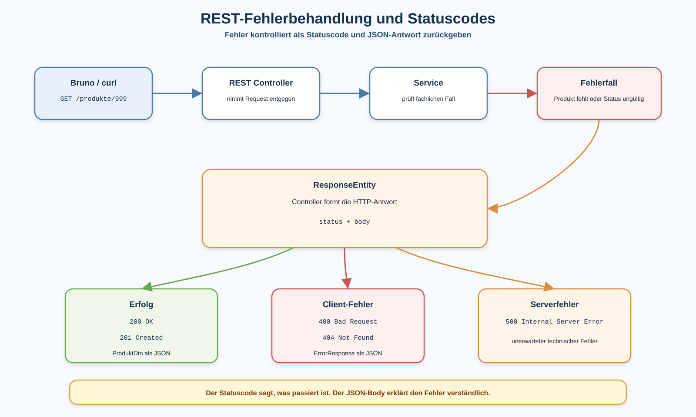

# Arbeitsblatt – REST-Fehlerbehandlung und Statuscodes

## Lernziele

- erklären, warum REST-APIs auch Fehler kontrolliert zurückgeben müssen
- erfolgreiche Antworten und Fehlerantworten unterscheiden
- die Statuscodes `200`, `201`, `400`, `404` und `500` fachlich einordnen
- `ResponseEntity` für Statuscode und Body verwenden
- eine einfache Fehlerantwort als JSON-DTO strukturieren
- Fehler bei unbekannter Produkt-ID kontrolliert behandeln
- Fehler bei ungültigem `ProduktStatus` gezielt prüfen
- Controller, Service und Fehlerbehandlung sauber trennen
- Fehlerfälle mit Bruno und `curl` nachvollziehbar testen

---

## Ausgangslage

Die REST-Lagerverwaltung kann Produkte lesen, erstellen, nach Status filtern und den Status ändern.

Bisher steht oft der Erfolgsfall im Zentrum:

```text
Request kommt an
-> Produkt wird gefunden
-> JSON mit Produkt wird zurückgegeben
```

In einer echten API reicht das nicht. Clients müssen auch verstehen, was schiefgelaufen ist.

Beispiel:

```bash
curl -i http://localhost:8080/produkte/999
```

Die ID `999` existiert nicht. Die API soll darauf nicht mit einem unklaren Serverfehler reagieren, sondern mit einer kontrollierten Antwort.



---

## Erfolgreiche Antwort und Fehlerantwort

Eine erfolgreiche Antwort enthält normalerweise die gewünschten Daten.

```http
HTTP/1.1 200 OK
Content-Type: application/json
```

```json
{
  "id": 1,
  "name": "Tastatur",
  "preis": 49.9,
  "status": "AKTIV"
}
```

Eine Fehlerantwort enthält keine normale Produktantwort. Sie erklärt den Fehler kontrolliert.

```http
HTTP/1.1 404 Not Found
Content-Type: application/json
```

```json
{
  "code": "PRODUCT_NOT_FOUND",
  "message": "Produkt wurde nicht gefunden.",
  "details": "id=999"
}
```

Wichtig:

```text
Der Statuscode beschreibt die technische Bedeutung.
Der JSON-Body beschreibt den Fehler verständlich.
```

---

## Wichtige Statuscodes

| Statuscode | Bedeutung | Typischer Fall in der Lagerverwaltung |
|---|---|---|
| `200 OK` | Anfrage war erfolgreich | Produktliste laden, Produktstatus ändern |
| `201 Created` | Neues Objekt wurde erstellt | Produkt anlegen |
| `400 Bad Request` | Request ist ungültig | unbekannter `ProduktStatus` |
| `404 Not Found` | Ressource existiert nicht | Produkt-ID wurde nicht gefunden |
| `500 Internal Server Error` | unerwarteter Serverfehler | Programmfehler oder technisches Problem |

Für fachlich erwartbare Fehler soll nicht einfach `500` zurückgegeben werden.

Beispiele:

- Produkt mit ID `999` existiert nicht: `404`
- Status `VERKAUFT` ist nicht im Enum erlaubt: `400`
- Code wirft unerwartet eine `NullPointerException`: `500`

---

## `ResponseEntity`

Mit `ResponseEntity` kann ein Controller Statuscode und Body bewusst festlegen.

Erfolgreiche Antwort:

```java
return ResponseEntity.ok(toDto(produkt));
```

Erstellen mit `201 Created`:

```java
return ResponseEntity.status(HttpStatus.CREATED).body(toDto(produkt));
```

Fehlerantwort mit `404 Not Found`:

```java
ErrorResponse error = new ErrorResponse(
        "PRODUCT_NOT_FOUND",
        "Produkt wurde nicht gefunden.",
        "id=" + id
);

return ResponseEntity.status(HttpStatus.NOT_FOUND).body(error);
```

`ResponseEntity` gehört in den Controller. Der Service soll weiterhin fachliche Arbeit leisten und nicht HTTP-Antworten bauen.

---

## Einfache Fehlerantwort als DTO

Eine kleine Fehlerantwort genügt für diese Einheit.

```java
public record ErrorResponse(
        String code,
        String message,
        String details
) {
}
```

Mögliche Antwort:

```json
{
  "code": "INVALID_PRODUCT_STATUS",
  "message": "Der Produktstatus ist ungültig.",
  "details": "status=VERKAUFT"
}
```

Vorteile:

- Clients erhalten immer eine ähnliche Fehlerstruktur.
- Fehlermeldungen sind nicht zufällig oder technisch.
- Bruno-Tests können Statuscode und JSON-Felder gezielt prüfen.

---

## Fehler bei unbekannter Produkt-ID

Der Service kann fachlich entscheiden, ob ein Produkt existiert.

Eine einfache Variante:

```java
public Optional<Produkt> findeProdukt(Long id) {
    return produktRepository.findeNachId(id);
}
```

Der Controller übersetzt das Ergebnis in HTTP:

```java
@GetMapping("/{id}")
public ResponseEntity<Object> produktNachId(@PathVariable Long id) {
    Optional<Produkt> produkt = produktService.findeProdukt(id);

    if (produkt.isPresent()) {
        return ResponseEntity.ok(toDto(produkt.get()));
    }

    ErrorResponse error = new ErrorResponse(
            "PRODUCT_NOT_FOUND",
            "Produkt wurde nicht gefunden.",
            "id=" + id
    );

    return ResponseEntity.status(HttpStatus.NOT_FOUND).body(error);
}
```

Die zentrale Idee:

```text
Service: Produkt vorhanden?
Controller: Welche HTTP-Antwort entsteht daraus?
```

---

## Fehler bei ungültigem Status

Wenn ein Pfad einen Enum-Wert enthält, kann ein ungültiger Wert nicht in `ProduktStatus` umgewandelt werden.

Beispiel:

```bash
curl -i -X PUT http://localhost:8080/produkte/1/status/VERKAUFT
```

`VERKAUFT` ist nicht erlaubt, wenn das Enum nur diese Werte enthält:

```java
public enum ProduktStatus {
    AKTIV,
    RESERVIERT,
    DEFEKT,
    ARCHIVIERT
}
```

Für diese Einheit genügt eine einfache lokale Behandlung im Controller oder eine kleine Hilfsmethode, welche den String bewusst prüft.

Beispiel:

```java
private Optional<ProduktStatus> parseStatus(String statusText) {
    try {
        return Optional.of(ProduktStatus.valueOf(statusText));
    } catch (IllegalArgumentException ex) {
        return Optional.empty();
    }
}
```

Damit kann der Controller bei einem ungültigen Status `400 Bad Request` zurückgeben.

---

## Bruno und `curl`

Bei Fehlerbehandlung reicht es nicht, nur den Erfolgsfall zu testen.

Prüfe mindestens:

| Fall | Request | Erwartung |
|---|---|---|
| gültige ID | `GET /produkte/1` | `200` mit Produkt-JSON |
| unbekannte ID | `GET /produkte/999` | `404` mit Fehler-JSON |
| gültiger Status | `PUT /produkte/1/status/ARCHIVIERT` | `200` mit Produkt-JSON |
| ungültiger Status | `PUT /produkte/1/status/VERKAUFT` | `400` mit Fehler-JSON |

Mit `curl -i` wird der Statuscode sichtbar:

```bash
curl -i http://localhost:8080/produkte/999
```

In Bruno sollen die Requests so benannt sein, dass Erfolgs- und Fehlerfälle erkennbar sind.

---

## Typische Fehler

| Fehlerbild | Problem |
|---|---|
| Immer `200` zurückgeben | Clients können Erfolg und Fehler nicht sauber unterscheiden |
| Stacktrace an Clients ausgeben | technische Details werden nach aussen sichtbar |
| `404` und `500` verwechseln | fachliche Fehler wirken wie Serverabstürze |
| Fehlertexte überall hartcodieren | Antworten werden uneinheitlich |
| Controller mit Fehlerlogik überladen | Verantwortlichkeiten verschwimmen |
| Ungültige Eingaben still ignorieren | Clients erhalten keine klare Rückmeldung |

---

## Reflexion

- Warum ist `404` bei einer unbekannten ID besser als `500`?
- Welche Information gehört in den Statuscode?
- Welche Information gehört in den JSON-Body?
- Warum sollte der Service keine `ResponseEntity` zurückgeben?
- Welche Bruno-Requests zeigen deine Fehlerbehandlung?

---

## Nicht-Ziele

Diese Einheit behandelt bewusst noch nicht:

- Bean Validation
- vertieftes `@ControllerAdvice`
- komplexe Exception-Hierarchien
- Security
- JPA
- globale Fehlerarchitektur
- Problem Details nach RFC 7807
