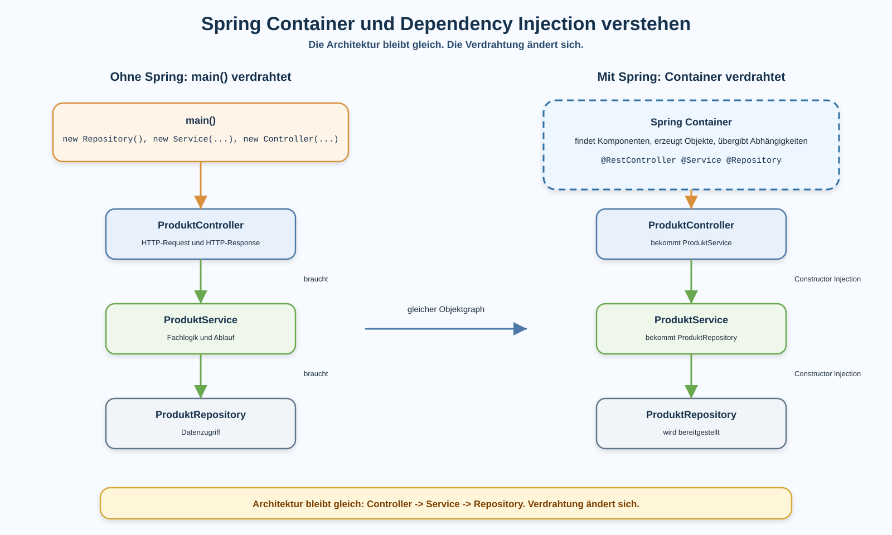

# Arbeitsblatt – Spring Container und Dependency Injection verstehen

## Lernziele

- erklären, wer Objekte in einer Spring-Boot-Anwendung erzeugt
- manuelle Verdrahtung mit Spring-Verdrahtung vergleichen
- den Spring Container als einfache Infrastruktur einordnen
- einen Objektgraphen aus Controller, Service und Repository lesen
- Constructor Injection als sichtbare Übergabe von Abhängigkeiten verstehen
- begründen, warum Spring die Architektur nicht ersetzt
- erklären, warum dieses Verständnis auf JPA und Spring Data vorbereitet

---

## Ausgangslage

Die REST-Lagerverwaltung hat eine klare Struktur:

```text
Controller -> Service -> Repository
```

Der Controller verarbeitet HTTP. Der Service enthält Fachlogik. Das Repository kapselt den Datenzugriff.

In der letzten Einheit wurden `@RestController`, `@Service`, `@Repository` und Constructor Injection eingeführt. Diese Einheit vertieft das mentale Modell dahinter:

```text
Spring ersetzt die Architektur nicht.
Spring erzeugt und verbindet die Objekte.
```



---

## Ohne Spring: `main()` verdrahtet

Ohne Spring müsste der Anwendungscode die Objekte selbst erzeugen und verbinden.

```java
public class LagerApp {

    public static void main(String[] args) {
        ProduktRepository repository = new ProduktRepository();
        ProduktService service = new ProduktService(repository);
        ProduktController controller = new ProduktController(service);
    }
}
```

Das ist manuelle Verdrahtung.

Der Objektgraph sieht so aus:

```text
ProduktController
  braucht ProduktService
    braucht ProduktRepository
```

Wichtig: Auch ohne Spring ist die Architektur erkennbar. Controller, Service und Repository bleiben getrennte Bausteine.

---

## Mit Spring: Container verdrahtet

Mit Spring erzeugt nicht mehr eine eigene `main()`-Methode den ganzen Objektgraphen. Spring übernimmt diese technische Aufgabe.

```java
@RestController
public class ProduktController {

    private final ProduktService produktService;

    public ProduktController(ProduktService produktService) {
        this.produktService = produktService;
    }
}
```

Der Controller sagt damit:

```text
Ich brauche einen ProduktService.
```

Er sagt nicht:

```text
Ich erzeuge mir selbst einen ProduktService.
```

Spring sieht den Konstruktor, erzeugt einen passenden `ProduktService` und übergibt ihn.

---

## Spring Container als einfache Idee

Für diese Einheit genügt ein einfaches Bild:

```text
Der Spring Container ist eine Objektverwaltung.
```

Er macht drei Dinge:

1. Er findet Klassen, die Spring verwalten soll.
2. Er erzeugt passende Objekte.
3. Er verbindet diese Objekte über Konstruktoren.

Beispiel:

| Klasse | Rolle |
|---|---|
| `ProduktController` | REST-Zugriffsschicht |
| `ProduktService` | Fachlogik |
| `ProduktRepository` | Datenzugriff |

Spring verwaltet diese Objekte, aber Spring entscheidet nicht, welche Fachlogik korrekt ist.

---

## Komponenten sichtbar machen

Spring erkennt verwaltete Bausteine über Annotationen.

### `@RestController`

```java
@RestController
public class ProduktController {
}
```

Der Controller nimmt HTTP-Requests entgegen und liefert HTTP-Antworten.

### `@Service`

```java
@Service
public class ProduktService {
}
```

Der Service enthält Fachlogik und Ablaufentscheidungen.

`@Service` führt keine Fachlogik automatisch aus. Die Methoden im Service bleiben normaler Java-Code.

### `@Repository`

```java
@Repository
public class ProduktRepository {
}
```

Das Repository kapselt Datenzugriff. In dieser Einheit bleibt es ein eigenes einfaches Repository.

---

## Constructor Injection

Constructor Injection bedeutet:

```text
Eine Klasse zeigt im Konstruktor, welche Abhängigkeiten sie braucht.
```

Controller:

```java
private final ProduktService produktService;

public ProduktController(ProduktService produktService) {
    this.produktService = produktService;
}
```

Service:

```java
private final ProduktRepository produktRepository;

public ProduktService(ProduktRepository produktRepository) {
    this.produktRepository = produktRepository;
}
```

Dadurch ist der Objektgraph im Code lesbar:

```text
Controller braucht Service.
Service braucht Repository.
```

Bei einem einzelnen Konstruktor braucht es in modernen Spring-Boot-Anwendungen kein `@Autowired` am Konstruktor.

---

## Architektur und Verdrahtung unterscheiden

Diese Unterscheidung ist zentral.

| Frage | Antwort |
|---|---|
| Wer verarbeitet HTTP? | Controller |
| Wer enthält Fachlogik? | Service |
| Wer kapselt Datenzugriff? | Repository |
| Wer erzeugt und verbindet die Objekte? | Spring Container |

Spring übernimmt die Verdrahtung. Die fachlichen Verantwortlichkeiten bleiben im eigenen Code.

```text
Architektur: Welche Bausteine gibt es und welche Aufgabe haben sie?
Verdrahtung: Wer erzeugt die Objekte und gibt sie weiter?
```

---

## Was bleibt gleich?

Die Architektur bleibt gleich:

```text
Controller -> Service -> Repository
```

Der Controller soll weiterhin nicht direkt auf das Repository zugreifen.

Der Service soll weiterhin keine HTTP-Antworten bauen.

Das Repository soll weiterhin keine Fachregeln entscheiden, die in den Service gehören.

Spring macht diese Trennung nicht automatisch richtig. Die Verantwortung bleibt beim Code-Design.

---

## Vorbereitung auf JPA und Spring Data

Später kann Spring auch Repository-Implementierungen bereitstellen.

Das wird erst verständlich, wenn vorher klar ist:

- Spring kann Objekte erzeugen.
- Spring kann Abhängigkeiten über Konstruktoren übergeben.
- Der Service braucht nur ein Repository.
- Der Service muss nicht wissen, wie dieses Repository konkret gebaut wird.

Deshalb kommt Dependency Injection vor JPA und Spring Data.

In dieser Einheit wird JPA noch nicht eingeführt.

---

## Typische Missverständnisse

### `@Service` führt Fachlogik automatisch aus

Nein. `@Service` macht die Klasse für Spring sichtbar. Die Fachlogik steht weiterhin in den Methoden.

### Spring ersetzt die Architektur

Nein. Spring verbindet Bausteine. Die Rollen von Controller, Service und Repository bleiben gleich.

### Dependency Injection bedeutet weniger Verantwortlichkeiten

Nein. DI ändert die Verdrahtung, nicht die Verantwortlichkeiten.

### Field Injection ist gleich gut

In dieser Reihe wird Constructor Injection verwendet, weil Abhängigkeiten sichtbar und stabil sind.

### Repository direkt im Controller ist in Ordnung

Nein. Spring kann das technisch verdrahten, aber die Architektur wäre trotzdem vermischt.

### Spring ist Magie

Spring wirkt nur dann wie Magie, wenn man den Objektgraphen nicht betrachtet. Mit Constructor Injection bleibt sichtbar, was verbunden wird.

---

## Reflexion

- Welche Objekte erzeugt Spring in der Lagerverwaltung?
- Welche Abhängigkeit braucht der Controller?
- Welche Abhängigkeit braucht der Service?
- Was würde eine manuelle `main()`-Verdrahtung tun?
- Warum ist die Architektur mit und ohne Spring dieselbe?
- Warum hilft dieses Verständnis vor JPA und Spring Data?
