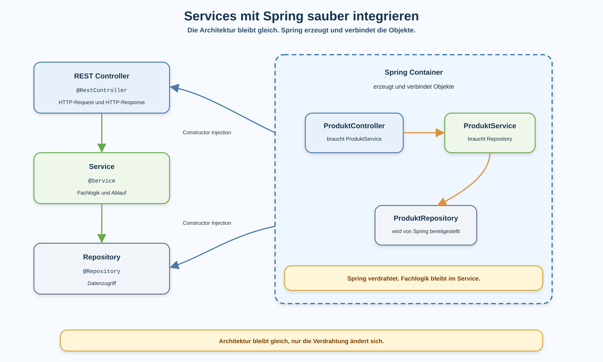

# Arbeitsblatt – Services mit Spring sauber integrieren

## Lernziele

- erklären, warum manuelle Objekterzeugung mit `new` in einer wachsenden REST-Anwendung unübersichtlich wird
- Spring als Infrastruktur für Objekterzeugung und Verdrahtung einordnen
- beschreiben, warum Spring die bestehende Architektur nicht ersetzt
- `@RestController`, `@Service` und `@Repository` ihren Rollen zuordnen
- Constructor Injection in Controller und Service lesen und anwenden
- `new`-Aufrufe im Controller und Service vermeiden
- Fachlogik im Service und Datenzugriff im Repository belassen
- typische Fehler bei Dependency Injection erkennen

---

## Ausgangslage

Die REST-Lagerverwaltung hat inzwischen mehrere klare Bausteine:

- Controller nehmen HTTP-Requests entgegen.
- DTOs strukturieren JSON-Eingaben und JSON-Ausgaben.
- Validation prüft einfache Request-Regeln.
- Services enthalten Fachlogik.
- Repositorys kapseln Datenzugriff.
- Fehler werden kontrolliert als REST-Antworten zurückgegeben.

Bisher wurden solche Objekte teilweise noch manuell erzeugt:

```java
ProduktRepository produktRepository = new ProduktRepository();
ProduktService produktService = new ProduktService(produktRepository);
ProduktController produktController = new ProduktController(produktService);
```

Bei wenigen Klassen ist das noch sichtbar. Sobald die Anwendung wächst, wird diese manuelle Verdrahtung aber unübersichtlich.

Die Kernidee dieser Einheit:

```text
Die Architektur bleibt gleich.
Spring erzeugt und verbindet die Objekte.
```



---

## Problem: manuelle Objekterzeugung

Ein Controller soll HTTP-Anfragen verarbeiten. Er soll aber nicht selbst entscheiden, wie ein Service erzeugt wird.

Ungünstiges Beispiel:

```java
@RestController
@RequestMapping("/produkte")
public class ProduktController {

    private final ProduktService produktService = new ProduktService(new ProduktRepository());

    @GetMapping
    public List<ProduktDto> alleProdukte() {
        return produktService.alleProdukte().stream()
                .map(this::toDto)
                .toList();
    }
}
```

Probleme:

- Der Controller kennt plötzlich die konkrete Repository-Erzeugung.
- Änderungen am Service-Konstruktor betreffen den Controller direkt.
- Tests und spätere Erweiterungen werden schwerer.
- Die fachliche Struktur ist zwar gemeint, aber technisch schlecht verdrahtet.

Der Controller soll nur sagen:

```text
Ich brauche einen ProduktService.
```

Nicht:

```text
Ich baue mir selbst einen ProduktService und ein ProduktRepository.
```

---

## Spring Container als einfache Idee

Der Spring Container ist für diese Einheit nur eine einfache Objektverwaltung:

```text
Spring findet passende Klassen.
Spring erzeugt Objekte.
Spring übergibt benötigte Abhängigkeiten über Konstruktoren.
```

Spring macht dadurch nicht die Fachlogik. Spring hilft nur bei der technischen Verdrahtung.

Die fachliche Verantwortung bleibt gleich:

| Baustein | Verantwortung |
|---|---|
| Controller | HTTP-Request und HTTP-Response |
| Service | Fachlogik und Ablauf |
| Repository | Datenzugriff |

---

## Rollen mit Annotationen sichtbar machen

Spring muss wissen, welche Klassen verwaltet werden sollen.

### `@RestController`

```java
@RestController
@RequestMapping("/produkte")
public class ProduktController {
}
```

Der Controller nimmt HTTP-Requests entgegen und gibt HTTP-Antworten zurück.

### `@Service`

```java
@Service
public class ProduktService {
}
```

Der Service enthält Fachlogik und koordiniert Abläufe.

### `@Repository`

```java
@Repository
public class ProduktRepository {
}
```

Das Repository kapselt Datenzugriff. In dieser Einheit ist das weiterhin ein einfaches Repository. Es ist noch kein Spring Data Repository.

---

## Constructor Injection im Controller

Der Controller beschreibt über den Konstruktor, was er braucht.

```java
@RestController
@RequestMapping("/produkte")
public class ProduktController {

    private final ProduktService produktService;

    public ProduktController(ProduktService produktService) {
        this.produktService = produktService;
    }

    @GetMapping
    public List<ProduktDto> alleProdukte() {
        return produktService.alleProdukte().stream()
                .map(this::toDto)
                .toList();
    }
}
```

Wichtig:

```text
Der Controller erzeugt den Service nicht selbst.
Spring übergibt den passenden Service.
```

Bei einem einzelnen Konstruktor braucht es in modernen Spring-Boot-Anwendungen kein `@Autowired` am Konstruktor.

---

## Constructor Injection im Service

Auch der Service beschreibt über den Konstruktor, welches Repository er braucht.

```java
@Service
public class ProduktService {

    private final ProduktRepository produktRepository;

    public ProduktService(ProduktRepository produktRepository) {
        this.produktRepository = produktRepository;
    }

    public List<Produkt> alleProdukte() {
        return produktRepository.alle();
    }

    public Produkt erstellen(String name, double preis, ProduktStatus status) {
        Produkt produkt = new Produkt(name, preis, status);
        return produktRepository.speichern(produkt);
    }
}
```

Der Service darf Fachobjekte erzeugen, wenn das fachlich zu seiner Aufgabe passt. Er soll aber nicht das Repository mit `new ProduktRepository()` erzeugen.

Eine wichtige Abgrenzung:

```text
In einfachen Unit-Tests darf ein Service weiterhin mit new erzeugt werden.
Dort wird gezielt ohne Spring getestet.
In der laufenden REST-Anwendung übernimmt Spring die Verdrahtung.
```

---

## Repository bleibt für Datenzugriff zuständig

Das Repository verwaltet Datenzugriff und Speicherlogik.

```java
@Repository
public class ProduktRepository {

    private final List<Produkt> produkte = new ArrayList<>();

    public List<Produkt> alle() {
        return new ArrayList<>(produkte);
    }

    public Produkt speichern(Produkt produkt) {
        produkte.add(produkt);
        return produkt;
    }
}
```

Wichtig:

```text
Das Repository baut keine ResponseEntity.
Das Repository enthält keine HTTP-Logik.
```

---

## Was ändert sich, was bleibt gleich?

| Bereich | Vorher | Nachher |
|---|---|---|
| Architektur | Controller, Service, Repository | Controller, Service, Repository |
| Fachlogik | im Service | im Service |
| Datenzugriff | im Repository | im Repository |
| Objekterzeugung | manuell mit `new` | Spring Container |
| Verdrahtung | von Hand | Constructor Injection |

Die Architektur bleibt gleich. Nur die technische Verdrahtung wird sauberer.

---

## Typische Fehler

### `new` bleibt im Controller

```java
private final ProduktService produktService = new ProduktService(new ProduktRepository());
```

Der Controller ist dadurch wieder für Verdrahtung zuständig. Das soll Spring übernehmen.

### Repository direkt im Controller verwenden

```java
private final ProduktRepository produktRepository;
```

Der Controller würde damit den Service umgehen. Fachlogik und Ablauf gehören in den Service.

### Field Injection verwenden

```java
@Autowired
private ProduktService produktService;
```

Diese Form versteckt Abhängigkeiten. In dieser Reihe wird Constructor Injection verwendet.

### Annotationen ohne Verständnis setzen

`@Service` und `@Repository` sind nicht Dekoration. Sie machen Rollen sichtbar und erlauben Spring die Verdrahtung.

### Spring als Ersatz für Architektur verstehen

Spring macht aus schlechtem Code keine gute Architektur. Die Verantwortlichkeiten müssen weiterhin stimmen.

---

## Bruno und `curl`

Nach der Umstellung auf Constructor Injection sollen bestehende Endpunkte gleich funktionieren.

Prüfe mindestens:

| Fall | Erwartung |
|---|---|
| `GET /produkte` | `200 OK` mit Produktliste |
| `GET /produkte/999` | `404 Not Found` mit Fehlerantwort |
| `POST /produkte` gültig | `201 Created` |
| `POST /produkte` ungültig | `400 Bad Request` |
| Statusänderung, falls vorhanden | gleicher Ablauf wie vor der Umstellung |

Wenn ein Endpunkt nach der DI-Umstellung nicht mehr funktioniert, prüfe zuerst:

- Ist die Klasse mit der passenden Annotation markiert?
- Gibt es genau einen klaren Konstruktor?
- Liegt die Klasse im Package-Bereich, den Spring scannt?
- Gibt es noch manuelle `new`-Aufrufe an falscher Stelle?

---

## Reflexion

- Welche Objekte erzeugt Spring in deiner Anwendung?
- Welche Abhängigkeit bekommt der Controller über den Konstruktor?
- Welche Abhängigkeit bekommt der Service über den Konstruktor?
- Warum bleibt Fachlogik im Service?
- Warum ist Dependency Injection ein sinnvoller Schritt vor JPA und Spring Data?
