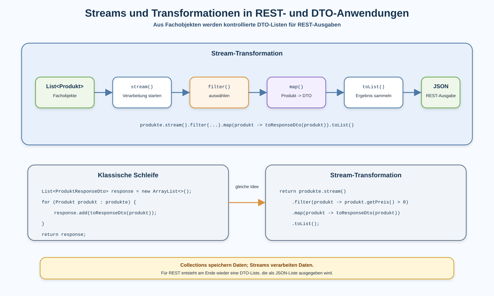

# Arbeitsblatt – Streams und Transformationen in REST- und DTO-Anwendungen

## Lernziele

- erklären, warum Streams bei REST-Listen und DTO-Mapping nützlich sind
- klassische Schleifen und Stream-Verarbeitung vergleichen
- Collections und Streams unterscheiden
- `stream()`, `map()`, `filter()` und `toList()` in einfachen Beispielen lesen
- einfache Lambda-Ausdrücke nachvollziehen
- DTO-Mapping mit `map()` als Transformation verstehen
- Produkte mit `filter()` gezielt auswählen
- Stream-Ergebnisse als `List` für REST-Ausgaben zurückgeben
- typische Fehler bei Stream-Code erkennen
- begründen, wann Stream-Code lesbar bleibt und wann eine Schleife klarer ist

---

## Ausgangslage

In der letzten Einheit wurden Collections eingeführt.

Ein REST-Endpunkt wie `GET /produkte` liefert mehrere DTOs:

```text
List<Produkt>
-> Mapping
-> List<ProduktResponseDto>
-> JSON-Liste
```

Bisher wurde das Mapping mit einer klassischen Schleife sichtbar gemacht:

```java
@GetMapping
public List<ProduktResponseDto> alleProdukte() {
    List<Produkt> produkte = lagerService.alleProdukte();
    List<ProduktResponseDto> response = new ArrayList<>();

    for (Produkt produkt : produkte) {
        response.add(toResponseDto(produkt));
    }

    return response;
}
```

Das ist korrekt und gut nachvollziehbar.

Jetzt entsteht ein neues Problem:

```text
Der Code beschreibt viele Einzelschritte.
Die eigentliche Idee ist aber: aus jedem Produkt wird ein DTO.
```

Streams helfen, diese Transformation direkt auszudrücken.



---

## Warum Streams?

Streams sind nützlich, wenn mehrere Elemente verarbeitet werden sollen.

Typische Aufgaben:

- aus Fachobjekten DTOs erzeugen
- nur passende Elemente auswählen
- eine Liste in eine andere Liste umwandeln
- Verarbeitungsschritte lesbar aneinanderreihen

Im REST-/DTO-Kontext bedeutet das oft:

```text
Produkte laden.
Produkte bei Bedarf filtern.
Produkte in Response-DTOs transformieren.
DTO-Liste zurückgeben.
```

Streams ersetzen nicht die Architektur. Controller, Service und Repository behalten ihre Aufgaben.

---

## Grenzen klassischer Schleifen

Eine klassische Schleife zeigt jeden Schritt einzeln:

```java
List<ProduktResponseDto> response = new ArrayList<>();

for (Produkt produkt : produkte) {
    ProduktResponseDto dto = toResponseDto(produkt);
    response.add(dto);
}
```

Vorteile:

- Ablauf ist sichtbar
- gut für den Einstieg
- einfach zu debuggen

Grenzen:

- zusätzlicher Zwischenspeicher ist nötig
- das Ziel der Verarbeitung ist nicht sofort sichtbar
- bei mehreren Verarbeitungsschritten wird der Code schnell länger

Stream-Code kann dieselbe Idee kompakter ausdrücken:

```java
List<ProduktResponseDto> response = produkte.stream()
        .map(produkt -> toResponseDto(produkt))
        .toList();
```

---

## Stream-Grundidee

Eine Collection speichert Daten.

Ein Stream verarbeitet Daten.

```text
List<Produkt>       speichert mehrere Produkte
Stream<Produkt>     verarbeitet diese Produkte Schritt für Schritt
```

Wichtig:

```text
Ein Stream ist keine neue dauerhafte Liste.
Ein Stream beschreibt eine Verarbeitung.
```

Am Ende wird mit `toList()` wieder eine Liste erzeugt.

---

## `stream()`

Mit `stream()` beginnt die Verarbeitung einer Collection:

```java
produkte.stream()
```

Dabei bleibt `produkte` weiterhin eine `List<Produkt>`.

Der Stream erlaubt danach Verarbeitungsschritte wie:

- `filter()`
- `map()`
- `toList()`

---

## `map()`

`map()` transformiert jedes Element.

Beispiel:

```java
produkte.stream()
        .map(produkt -> toResponseDto(produkt))
        .toList();
```

Bedeutung:

```text
Nimm jedes Produkt.
Erzeuge daraus ein ProduktResponseDto.
Sammle alle DTOs wieder in einer Liste.
```

`map()` passt gut zu DTOs, weil DTO-Mapping genau eine Transformation ist:

```text
Produkt -> ProduktResponseDto
```

---

## Einfache Lambda-Ausdrücke

Ein Lambda-Ausdruck beschreibt eine kleine Aktion.

```java
produkt -> toResponseDto(produkt)
```

Lies das so:

```text
Für ein produkt: rufe toResponseDto(produkt) auf.
```

In dieser Einheit bleiben Lambda-Ausdrücke klein.

Wenn der Ausdruck lang wird, gehört der Code meistens in eine eigene Methode:

```java
private ProduktResponseDto toResponseDto(Produkt produkt) {
    return new ProduktResponseDto(
            produkt.getId(),
            produkt.getName(),
            produkt.getPreis()
    );
}
```

---

## `filter()`

`filter()` wählt Elemente aus.

Beispiel:

```java
produkte.stream()
        .filter(produkt -> produkt.getPreis() > 0)
        .map(produkt -> toResponseDto(produkt))
        .toList();
```

Bedeutung:

```text
Nur Produkte mit Preis grösser 0 bleiben im Stream.
Diese Produkte werden danach in DTOs transformiert.
```

`filter()` verändert die Produkte nicht. Es entscheidet nur, welche Elemente weiterverarbeitet werden.

In dieser Einheit bleiben Filter bewusst einfach. Wenn eine Filterregel fachlich wichtig oder umfangreich wird, gehört sie eher in den Service als direkt in den Controller.

---

## `toList()`

`toList()` sammelt das Stream-Ergebnis wieder in einer Liste:

```java
List<ProduktResponseDto> response = produkte.stream()
        .map(produkt -> toResponseDto(produkt))
        .toList();
```

Für REST ist das wichtig:

```text
Der Controller gibt weiterhin eine List<ProduktResponseDto> zurück.
Spring Boot macht daraus weiterhin eine JSON-Liste.
```

Die JSON-Struktur muss sich nicht ändern, nur weil der Java-Code intern Streams verwendet.

---

## DTO-Mapping mit Streams

Ein vollständiger Controller-Ausschnitt kann so aussehen:

```java
@GetMapping
public List<ProduktResponseDto> alleProdukte() {
    List<Produkt> produkte = lagerService.alleProdukte();

    return produkte.stream()
            .map(produkt -> toResponseDto(produkt))
            .toList();
}
```

Das Mapping bleibt kontrolliert:

```java
private ProduktResponseDto toResponseDto(Produkt produkt) {
    return new ProduktResponseDto(
            produkt.getId(),
            produkt.getName(),
            produkt.getPreis()
    );
}
```

Der Controller gibt keine Fachobjekte direkt zurück. Die REST-Ausgabe bleibt eine DTO-Liste.

---

## Transformation statt Mutation

Bei Streams steht die Transformation im Zentrum.

Gemeint ist:

```text
Aus einem Element entsteht ein anderes Element.
```

Beispiel:

```text
Produkt -> ProduktResponseDto
```

Nicht gemeint ist:

```text
Ändere jedes Produkt im Stream direkt.
```

Vermeide Seiteneffekte in Streams:

```java
// ungünstig
produkte.stream()
        .map(produkt -> {
            produkt.setPreis(0);
            return toResponseDto(produkt);
        })
        .toList();
```

Dieser Code vermischt Transformation und Änderung am Fachobjekt.

---

## Streams in REST-/DTO-Anwendungen

Streams passen besonders gut, wenn der Controller oder eine Mapping-Methode eine Liste transformiert:

```java
return produkte.stream()
        .filter(produkt -> produkt.getPreis() > 0)
        .map(produkt -> toResponseDto(produkt))
        .toList();
```

Trotzdem gilt:

```text
Streams machen schlechten Code nicht automatisch gut.
```

Die Verantwortlichkeiten bleiben wichtig:

| Aufgabe | Gehört eher nach |
|---|---|
| Produkte laden | Service / Repository |
| fachliche Regeln anwenden | Service |
| DTOs für REST-Ausgabe erzeugen | Controller oder Mapping-Methode |
| JSON zurückgeben | REST Controller |

---

## Typische Fehler

| Fehler | Problem |
|---|---|
| Collection und Stream verwechseln | ein Stream speichert Daten nicht dauerhaft |
| `map()` und `filter()` verwechseln | Transformation und Auswahl werden vermischt |
| Stream ohne `toList()` verwenden | es entsteht keine Rückgabeliste |
| zu lange Stream-Ketten bauen | der Code wird schwer lesbar |
| Fachlogik direkt in Lambdas schreiben | Verantwortlichkeiten werden unklar |
| fachliche Filter im Controller wachsen lassen | Service-Verantwortung wird umgangen |
| Seiteneffekte in `map()` einbauen | Transformation verändert plötzlich Fachobjekte |
| Fachobjekte direkt zurückgeben | DTO-Trennung geht verloren |
| Streams nur verwenden, weil sie kürzer sind | Lesbarkeit wird nicht automatisch besser |

---

## Nicht-Ziele dieser Einheit

Bewusst noch nicht behandelt werden:

- komplexe Stream-Pipelines
- `reduce()`
- `groupingBy()`
- parallele Streams
- Collector-API vertiefen
- funktionale Interfaces vertiefen
- `Optional`
- reactive Streams
- verschachtelte Streams
- Performance-Optimierung
- Method References als eigenes Thema
- komplexe Lambda-Ausdrücke

---

## Reflexion

Beantworte kurz:

1. Warum passt `map()` gut zu DTO-Mapping?
2. Was ist der Unterschied zwischen einer `List` und einem `Stream`?
3. Warum braucht der REST-Endpunkt am Ende wieder eine `List`?
4. Wann ist `filter()` sinnvoll?
5. Wann kann eine klassische Schleife verständlicher sein als ein Stream?
