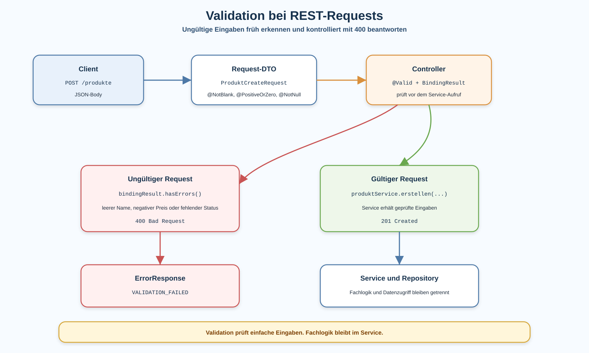

# Arbeitsblatt – Validation bei REST-Requests

## Lernziele

- erklären, warum REST-Requests vor der Verarbeitung geprüft werden müssen
- Eingabevalidierung von Fachlogik unterscheiden
- einfache Bean Validation auf Request-DTOs anwenden
- `@Valid` im REST Controller einordnen
- einfache Validierungsfehler als `400 Bad Request` zurückgeben
- kontrollierte Fehlermeldungen mit Bruno und `curl -i` prüfen
- typische Fehler bei Validation erkennen
- Controller, DTO, Service und Fehlerantwort sauber trennen

---

## Ausgangslage

Die REST-Lagerverwaltung kann fehlende Produkte mit `Optional` sichtbar behandeln und Fehler kontrolliert als HTTP-Antwort zurückgeben.

Der nächste typische Fehlerfall entsteht bereits beim Request:

```text
POST /produkte
```

Ein Client sendet JSON, aber die Werte sind unvollständig oder fachlich nicht brauchbar.

Beispiel:

```json
{
  "name": "",
  "preis": -5,
  "status": "AKTIV"
}
```

Ohne Validation müsste der Service später mit ungültigen Daten umgehen. Besser ist:

```text
Der Controller nimmt den Request entgegen.
Das Request-DTO beschreibt einfache Eingaberegeln.
Ungültige Requests werden mit 400 Bad Request abgewiesen.
Der Service erhält nur bereits geprüfte Eingaben.
```



---

## Warum Validation?

Eine REST-API bekommt Daten von aussen. Diese Daten können fehlen, leer sein oder fachlich unsinnig wirken.

Typische Beispiele:

| Feld | Problem | Erwartung |
|---|---|---|
| `name` | fehlt oder ist leer | Produkt braucht einen Namen |
| `preis` | ist negativ | Preis muss mindestens `0` sein |
| `status` | fehlt | Status muss gesetzt sein |

Validation macht solche Regeln früh sichtbar.

Wichtig:

```text
Validation prüft einfache Eingaberegeln.
Fachlogik bleibt im Service.
```

Beispiele:

- `name` darf nicht leer sein: Validation
- `preis` darf nicht negativ sein: Validation
- Produkt mit gleicher ID existiert schon: eher Service oder Repository
- Statuswechsel von `ARCHIVIERT` zurück zu `AKTIV` ist verboten: Fachlogik im Service

---

## Bean Validation vorbereiten

In Spring Boot wird Bean Validation über einen Starter eingebunden.

Im `pom.xml`:

```xml
<dependency>
    <groupId>org.springframework.boot</groupId>
    <artifactId>spring-boot-starter-validation</artifactId>
</dependency>
```

Danach können Request-DTOs mit Annotationen aus `jakarta.validation.constraints` beschrieben werden.

---

## Request-DTO mit Regeln

Ein Request-DTO beschreibt die Daten, die ein Client senden darf.

Beispiel:

```java
package ch.allianz.youngoitv.lager.api;

import ch.allianz.youngoitv.lager.domain.ProduktStatus;
import jakarta.validation.constraints.NotBlank;
import jakarta.validation.constraints.NotNull;
import jakarta.validation.constraints.PositiveOrZero;

public record ProduktCreateRequest(
        @NotBlank(message = "Name darf nicht leer sein.")
        String name,

        @PositiveOrZero(message = "Preis darf nicht negativ sein.")
        double preis,

        @NotNull(message = "Status muss gesetzt sein.")
        ProduktStatus status
) {
}
```

Die Annotationen beschreiben einfache Regeln:

| Annotation | Bedeutung |
|---|---|
| `@NotBlank` | Text darf nicht `null`, leer oder nur Leerzeichen sein |
| `@PositiveOrZero` | Zahl muss `0` oder grösser sein |
| `@NotNull` | Wert muss vorhanden sein |

Das DTO bleibt eine API-Struktur. Es ersetzt nicht das Fachmodell.

---

## `@Valid` im Controller

Damit Spring die Regeln prüft, wird der Request im Controller mit `@Valid` markiert.

```java
@PostMapping
public ResponseEntity<Object> produktErstellen(
        @Valid @RequestBody ProduktCreateRequest request,
        BindingResult bindingResult
) {
    if (bindingResult.hasErrors()) {
        ErrorResponse error = new ErrorResponse(
                "VALIDATION_FAILED",
                "Request ist ungültig.",
                ersteFehlermeldung(bindingResult)
        );

        return ResponseEntity.badRequest().body(error);
    }

    Produkt produkt = produktService.erstellen(
            request.name(),
            request.preis(),
            request.status()
    );

    return ResponseEntity.status(HttpStatus.CREATED).body(toDto(produkt));
}
```

Benötigte Imports:

```java
import jakarta.validation.Valid;
import org.springframework.validation.BindingResult;
```

Für diese Einheit genügt eine einfache Fehlermeldung:

```java
private String ersteFehlermeldung(BindingResult bindingResult) {
    return bindingResult.getFieldErrors().stream()
            .findFirst()
            .map(error -> error.getField() + ": " + error.getDefaultMessage())
            .orElse("Unbekannter Validierungsfehler.");
}
```

Damit bleibt der Ablauf sichtbar und kontrolliert.

---

## Fehlerantwort bei ungültigem Request

Ein ungültiger Request ist ein Client-Fehler. Deshalb passt:

```http
HTTP/1.1 400 Bad Request
Content-Type: application/json
```

Beispielantwort:

```json
{
  "code": "VALIDATION_FAILED",
  "message": "Request ist ungültig.",
  "details": "name: Name darf nicht leer sein."
}
```

Die bestehende Fehlerstruktur kann weiterverwendet werden:

```java
public record ErrorResponse(
        String code,
        String message,
        String details
) {
}
```

Wichtig:

```text
Validation-Fehler sind keine 500-Fehler.
Der Client hat ungültige Daten gesendet.
```

---

## Was gehört wohin?

| Ort | Verantwortung |
|---|---|
| Request-DTO | einfache Eingaberegeln mit Annotationen |
| Controller | Request prüfen und HTTP-Antwort bauen |
| Service | Fachlogik ausführen |
| Repository | Daten speichern und laden |
| ErrorResponse | Fehler einheitlich als JSON beschreiben |

Der Service soll nicht wissen, ob ein Request mit `@Valid` geprüft wurde. Er erhält bereits einfache, geprüfte Werte und bleibt fachlich.

---

## Typische Fehler

### Validation auf dem Fachmodell statt auf dem Request-DTO

Für diese Reihe ist es klarer, die ersten Regeln auf dem Request-DTO zu platzieren.

```text
Request-DTO: Was darf von aussen kommen?
Fachmodell: Welche Daten beschreibt die Anwendung intern?
```

### `@Valid` vergessen

Wenn `@Valid` fehlt, werden die Annotationen nicht für den Request ausgeführt.

### Validation und Fachlogik vermischen

Nicht jede Regel ist eine einfache Eingaberegel.

```text
Leerer Name: Validation
Komplexer Statuswechsel: Service
```

### Technische Fehlermeldung zurückgeben

Stacktraces oder rohe Exception-Texte gehören nicht in die API-Antwort. Clients brauchen eine kontrollierte Fehlerstruktur.

---

## Bruno und `curl`

Prüfe mindestens diese Fälle:

| Fall | Request | Erwartung |
|---|---|---|
| gültiges Produkt | `POST /produkte` mit Name, Preis und Status | `201 Created` |
| leerer Name | `POST /produkte` mit `name: ""` | `400 Bad Request` |
| negativer Preis | `POST /produkte` mit `preis: -5` | `400 Bad Request` |
| fehlender Status | `POST /produkte` ohne `status` | `400 Bad Request` |

Beispiel mit `curl`:

```bash
curl -i -X POST http://localhost:8080/produkte \
  -H "Content-Type: application/json" \
  -d '{"name":"","preis":-5,"status":"AKTIV"}'
```

Erwartung:

```text
HTTP/1.1 400
```

und eine JSON-Fehlerantwort mit `VALIDATION_FAILED`.

---

## Reflexion

- Welche Regeln gehören auf das Request-DTO?
- Welche Regeln gehören weiterhin in den Service?
- Warum ist `400 Bad Request` hier passender als `500 Internal Server Error`?
- Wie hilft Validation dabei, Controller, Service und Repository sauber zu halten?
